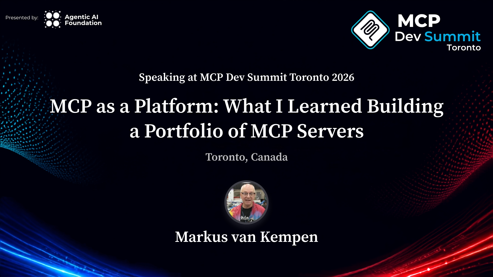

[](https://events.linuxfoundation.org/mcp-dev-summit-toronto/program/schedule/?id=1282401)

# MCP Ticket Demo — A Full-Stack MCP Reference Server

[](https://www.npmjs.com/package/mcp-ticket-demo)
[](https://www.npmjs.com/package/mcp-ticket-demo)
[](https://marketplace.visualstudio.com/items?itemName=MarkusvanKempen.lf-mcp-summit-demo)
[](https://open-vsx.org/extension/markusvankempen/lf-mcp-summit-demo)
[](LICENSE)
[](https://nodejs.org/)
[](https://modelcontextprotocol.io/)
[](https://www.ibm.com/products/code-engine)
[](https://events.linuxfoundation.org/mcp-dev-summit-toronto/program/schedule/?id=1282401)

A **production-shaped MCP server** you can run in under five minutes. Ships with 10 tools, 3 resources, 5 prompts, three auth modes, API key management, per-tool gates, rate limiting, a live observability dashboard, and a VS Code / Bob / Cursor / Windsurf control-plane extension.

Use it to **learn MCP**, **test IDE integrations**, run **live demos**, or as a **reference implementation** when building your own server.

> Companion to [**MCP as a Platform: What I Learned Building a Portfolio of MCP Servers**](https://events.linuxfoundation.org/mcp-dev-summit-toronto/program/schedule/?id=1282401) · MCP Dev Summit Toronto · 5 October 2026 · [**Talk slides →**](https://markusvankempen.github.io/linuxfoundation-mcp-dev-summit/#1)

| | |
|---|---|
| **MCP server** | [`npm install mcp-ticket-demo`](https://www.npmjs.com/package/mcp-ticket-demo) |
| **VS Code extension** | [VS Code Marketplace](https://marketplace.visualstudio.com/items?itemName=MarkusvanKempen.lf-mcp-summit-demo) · [Open VSX](https://open-vsx.org/extension/markusvankempen/lf-mcp-summit-demo) |
| **Talk slides** | [markusvankempen.github.io/linuxfoundation-mcp-dev-summit](https://markusvankempen.github.io/linuxfoundation-mcp-dev-summit/#1) |

Personal open-source project. **Not an IBM product.**

---

## What makes this useful beyond a hello-world

Most MCP examples stop at "here is a tool that returns a string." This one goes further:

| Feature | What you learn |
|---|---|
| **10 tools with intent-named descriptions** | Naming is the interface — not `request(path, method)` |
| **3 resources** (`ticket://`, `tickets://open`, `schema://`) | `resources/list` enumerates instances; reads use the same `gate()` as the matching tool |
| **5 MCP prompts** | User-facing prompts vs agent-facing tools |
| **Tool annotations** (`readOnlyHint`, `destructiveHint`, `idempotentHint`, `openWorldHint: false`) | Client confirm/retry UX |
| **Server instructions** | The README the model actually reads |
| **`isError: true` on every failure** | Clients don't need to parse `ok: false` |
| **Attribution scar** — `create_ticket` without `requester_email` | 201 is not done. The bot owns the ticket. |
| **Schema discovery** — `list_schemas → get_schema → run_query` | One query tool beats a pile of `query_*` names |
| **0 tools discovered** — hand a laptop path to a cloud runner | The silent failure with no error and no warning |
| **stdio + SSE + Streamable HTTP** from one codebase | Two transports, same 10 tools |
| **Auth modes** (`off` / `write` / `all`) + per-tool gate + per-tool auth lock | Security is an operator concern |
| **`tools/list_changed` broadcast** when admin flips a gate | SSE **and** Streamable HTTP sessions refresh; one-shot curl does not |
| **Rate limiting** with `retry_after_seconds` in the error | Stop the model retrying in a loop |
| **PII redaction** on `lookup_customer` | Scope-gated field visibility |
| **`/health` vs `/test`** | Alive ≠ works. Public `/test` is read-only; `cwd` stays off public `/health` |
| **Live observability** — `/log` page with counters, error log, call trace | See what the model is actually doing |

---

## Quickstart — five minutes

```bash
# Run directly from npm — no clone needed
npx mcp-ticket-demo           # stdio (IDE spawns this)
MCP_MODE=http npx mcp-ticket-demo  # HTTP — opens /health /test /admin /mcp

# Or clone and run
git clone https://github.com/markusvankempen/mcp-ticket-demo
cd mcp-ticket-demo/server && npm install && npm run http
```

Then open in a browser:

| URL | What it shows |
|---|---|
| http://127.0.0.1:8787/health | Is the process alive? (`cwd` only on localhost) |
| http://127.0.0.1:8787/test | Read-only smoke (search / get / schemas / query) |
| http://127.0.0.1:8787/admin | Auth mode, API keys, tool gates, observability |
| http://127.0.0.1:8787/log | Call counters, error log, full call trace |
| http://127.0.0.1:8787/tools | Tool inventory with scope and auth status |

Laptop login: `demo` / `demo`. On a public bind (`HOST=0.0.0.0`, container, Code Engine) set `ADMIN_PASSWORD` — the default is disabled. Write smoke is `/test?write=1` after admin sign-in.

---

## Add to your IDE (one line)

**VS Code / GitHub Copilot** — `.vscode/mcp.json`:
```json
{
  "servers": {
    "mcp-ticket-demo": {
      "type": "stdio",
      "command": "npx",
      "args": ["mcp-ticket-demo"],
      "env": { "MCP_MODE": "stdio" }
    }
  }
}
```

**Bob / Cursor / Windsurf** — `.bob/mcp.json` / `.cursor/mcp.json` / `.windsurf/mcp.json`:
```json
{
  "mcpServers": {
    "mcp-ticket-demo": {
      "command": "npx",
      "args": ["mcp-ticket-demo"],
      "env": { "MCP_MODE": "stdio" }
    }
  }
}
```

Or install the extension and click **Register server with all IDEs** — it writes all four configs at once:
[VS Code Marketplace](https://marketplace.visualstudio.com/items?itemName=MarkusvanKempen.lf-mcp-summit-demo) · [Open VSX](https://open-vsx.org/extension/markusvankempen/lf-mcp-summit-demo)

---

## 10 Tools

| Tool | Scope | When to use | Lesson |
|---|---|---|---|
| `describe_server` | open | First call, and after any denial | Discovery beats guessing |
| `search_tickets` | `read` | Find by status / requester / keyword | Intent name, not an HTTP wrapper |
| `get_ticket` | `read` | You already have a `TCK-…` id | Instance fetch |
| `create_ticket` | `write` | Open a ticket — **always pass `requester_email`** | Omit it → 201 + bot owns the ticket |
| `add_comment` | `write` | Comment on a known ticket | Write tool; gated |
| `close_ticket` | `write` | Resolve a ticket, optionally add resolution note | `destructiveHint: true, idempotentHint: true` |
| `list_schemas` | `read` | Before any query | Discover the shape |
| `get_schema` | `read` | After list, before query | Fields + filterable keys |
| `run_query` | `read` | The one query tool | Replaces `query_tickets` / `query_assets` / … |
| `lookup_customer` | `pii` | Customer record — phone is PII | Redacted without `pii` scope |

---

## 3 Resources

Resources are **addressable and pinnable** — clients can subscribe and refresh. Tools are for agent loops.

| URI | What it returns | Same gate as |
|---|---|---|
| `ticket://TCK-1001` | One ticket by id | `get_ticket` |
| `tickets://open` | Live open ticket list (top 25) | `search_tickets` |
| `schema://tickets` | Query schema shape (also `customers`, `assets`) | `get_schema` / `list_schemas` |

Call `resources/list` to browse — you do not need to know a URI ahead of time. A denied read is a JSON-RPC error (not a fake ticket document you can pin).

---

## 5 Prompts

User-facing prompts — the **user** picks these, the model executes them.

| Prompt | Lesson it teaches |
|---|---|
| `search-open-tickets` | Find service-account scars in the live data |
| `attribution-scar` | Create without `requester_email` → explain what broke |
| `schema-discovery` | `list_schemas → get_schema → run_query` walkthrough |
| `close-ticket-flow` | `add_comment` then `close_ticket` in sequence |
| `diagnose-server` | `describe_server` — auth mode, scopes, available tools |

---

## Auth model

```
off    All tools open. No credential needed. Default for local dev.
write  Read tools open. write + pii tools need a credential.
all    Every tool call requires a credential.
```

Credentials: `Authorization: Bearer <api key>` over HTTP · `MCP_API_KEY` env var over stdio.

Issue keys, set modes, toggle per-tool gates, and lock individual tools on `/admin`.
A change broadcasts `notifications/tools/list_changed` to connected SSE and Streamable HTTP sessions (Cursor/Bob after `initialize`). One-shot `POST /mcp` (curl) has no session — it sees the new list on the next call.

---

## Repo layout

```
mcp-ticket-demo/
  server/       MCP server — tools, resources, prompts, auth, HTTP pages
  extension/    VS Code / Bob / Cursor / Windsurf control-plane extension
  docs/         Walkthroughs, lessons learned, publishing guide
  Dockerfile    UBI9 minimal, non-root USER 1001, WORKDIR /app
```

---

## Docs

| Doc | What's in it |
|---|---|
| [docs/DEMO.md](docs/DEMO.md) | **End-to-end demo guide** — 11 live curl demos, every lesson, real captured output |
| [docs/LESSONS-LEARNED.md](docs/LESSONS-LEARNED.md) | **15 lessons** building a real MCP server — war stories + pre-publish checklist |
| [docs/LOCAL.md](docs/LOCAL.md) | Local stdio + HTTP walkthrough |
| [docs/REMOTE.md](docs/REMOTE.md) | Code Engine deploy + the 0-tools-discovered repro |
| [docs/ADMIN-AND-SECURITY.md](docs/ADMIN-AND-SECURITY.md) | Auth modes, API keys, tool gates |
| [docs/BOB.md](docs/BOB.md) | IBM Bob specific setup |
| [docs/PUBLISHING.md](docs/PUBLISHING.md) | npm + MCP Registry + VS Code Marketplace publish steps |
| [server/README.md](server/README.md) | Full curl reference for every endpoint |

---

## Environment variables

| Variable | Default | What it does |
|---|---|---|
| `MCP_MODE` | `stdio` | `stdio` or `http` |
| `PORT` | `8080` | HTTP only |
| `HOST` | `127.0.0.1` | `0.0.0.0` inside container (set automatically) |
| `AUTH_MODE` | `off` | `off` · `write` · `all` |
| `ADMIN_USER` / `ADMIN_PASSWORD` | `demo` / `demo` | `/admin` login. Default disabled on a public bind until `ADMIN_PASSWORD` is set |
| `CORS_ORIGINS` | unset | Extra `Origin` values allowed on `/mcp`. Localhost and same-host are always allowed |
| `API_KEY` / `API_KEY_SCOPES` | unset | Register one key at boot |
| `MCP_API_KEY` | unset | stdio credential |
| `MCP_USERNAME` / `MCP_PASSWORD` | unset | stdio basic auth |
| `MCP_USERS` | unset | `"alice:secret:read,write"` extra logins |
| `RATE_LIMIT` / `RATE_LIMIT_WINDOW_MS` | `60` / `60000` | Calls per window per caller |
| `TENANT_ID` | unset | If set, writes need `x-tenant-id` header |

---

## Honest limits

- Tickets live in memory — a new container starts from seed data.
- Admin auth is a session cookie, not SSO. Cookie is `HttpOnly` (+ `Secure` on HTTPS).
- `/health` being green does not mean the ticket went to the right person.
- Public `/test` does not create or close tickets. Use `/test?write=1` after admin sign-in.

---

**Author:** Markus van Kempen ·
[markus.van.kempen@gmail.com](mailto:markus.van.kempen@gmail.com) ·
[markusvankempen.github.io](https://markusvankempen.github.io/) ·
[MCP Dev Summit Toronto talk](https://events.linuxfoundation.org/mcp-dev-summit-toronto/program/schedule/?id=1282401) ·
[Talk slides](https://markusvankempen.github.io/linuxfoundation-mcp-dev-summit/#1) ·
[npm](https://www.npmjs.com/package/mcp-ticket-demo) ·
[VS Code Marketplace](https://marketplace.visualstudio.com/items?itemName=MarkusvanKempen.lf-mcp-summit-demo) ·
[Open VSX](https://open-vsx.org/extension/markusvankempen/lf-mcp-summit-demo)
