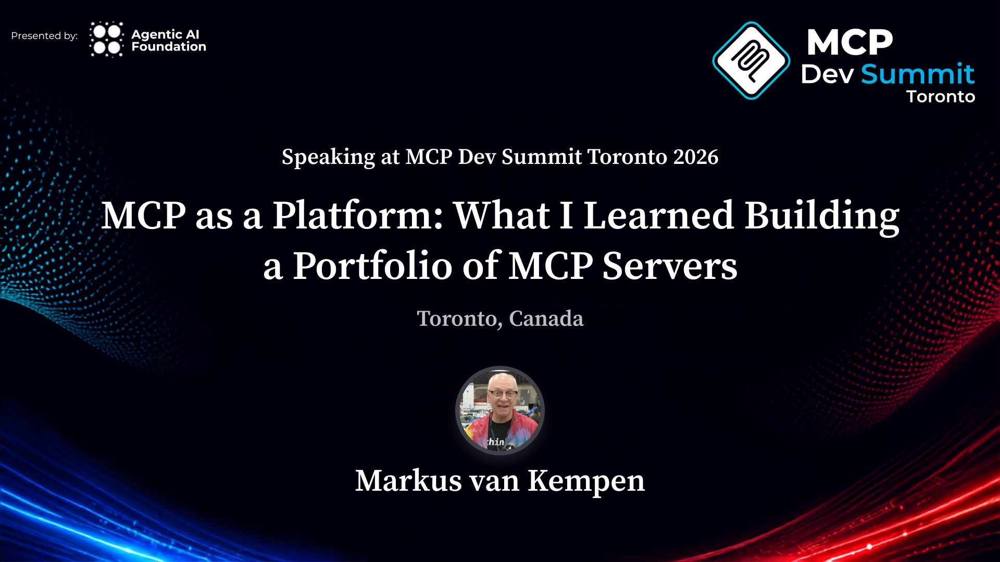
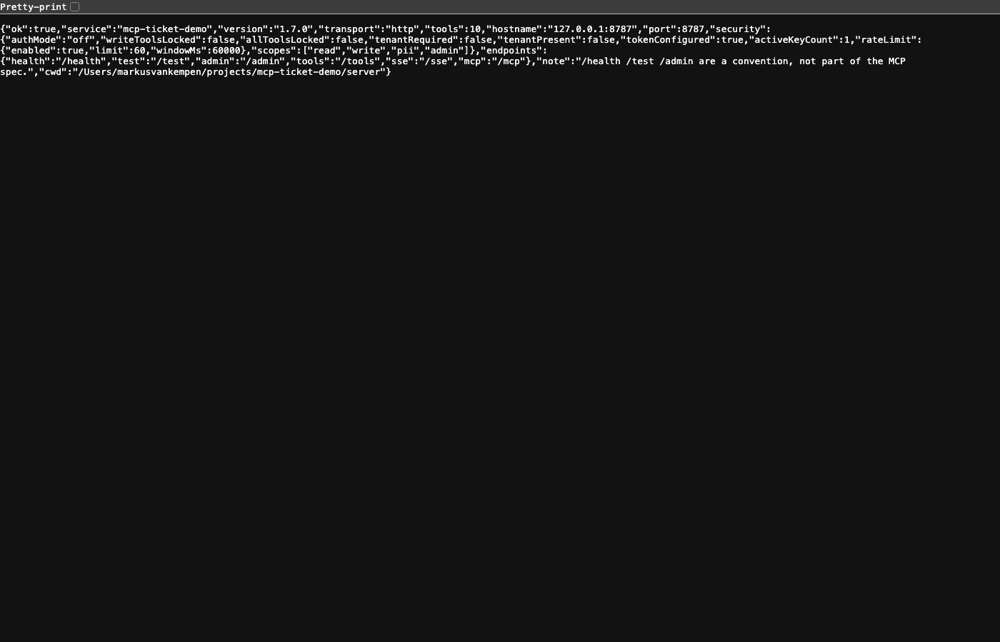

[](https://events.linuxfoundation.org/mcp-dev-summit-toronto/program/schedule/?id=1282401)

# MCP Ticket Demo — A Full-Stack MCP Reference Server

[](https://www.npmjs.com/package/mcp-ticket-demo)
[](https://www.npmjs.com/package/mcp-ticket-demo)
[](https://marketplace.visualstudio.com/items?itemName=MarkusvanKempen.lf-mcp-summit-demo)
[](https://open-vsx.org/extension/markusvankempen/lf-mcp-summit-demo)
[](LICENSE)
[](https://nodejs.org/)
[](https://modelcontextprotocol.io/)
[](https://www.ibm.com/products/code-engine)
[](https://events.linuxfoundation.org/mcp-dev-summit-toronto/program/schedule/?id=1282401)

A **production-shaped MCP server** you can run in under five minutes. Ships with 19 tools, 3 resources, 5 prompts, three auth modes, API key management, per-tool gates, rate limiting, a live observability dashboard, and a VS Code / Bob / Cursor / Windsurf control-plane extension.

Use it to **learn MCP**, **test IDE integrations**, run **live demos**, or as a **reference implementation** when building your own server.

> Companion to [**MCP as a Platform: What I Learned Building a Portfolio of MCP Servers**](https://events.linuxfoundation.org/mcp-dev-summit-toronto/program/schedule/?id=1282401) · MCP Dev Summit Toronto · 5 October 2026 · [**Talk slides →**](https://markusvankempen.github.io/linuxfoundation-mcp-dev-summit/#1)

| | |
|---|---|
| **MCP server** (3.0.1) | [`npm install mcp-ticket-demo`](https://www.npmjs.com/package/mcp-ticket-demo) |
| **VS Code extension** (1.16.0) | [VS Code Marketplace](https://marketplace.visualstudio.com/items?itemName=MarkusvanKempen.lf-mcp-summit-demo) · [Open VSX](https://open-vsx.org/extension/markusvankempen/lf-mcp-summit-demo) |
| **Talk slides** | [markusvankempen.github.io/linuxfoundation-mcp-dev-summit](https://markusvankempen.github.io/linuxfoundation-mcp-dev-summit/#1) |

Personal open-source project.

---

## What makes this useful beyond a hello-world

Most MCP examples stop at "here is a tool that returns a string." This one goes further:

| Feature | What you learn |
|---|---|
| **19 tools with intent-named descriptions** | Nouns live in a schema, verbs stay as tools — not `request(path, method)` |
| **3 resources** (`ticket://`, `tickets://open`, `schema://`) | `resources/list` enumerates instances; reads use the same `gate()` as the matching tool |
| **5 MCP prompts** | User-facing prompts vs agent-facing tools |
| **Tool annotations** (`readOnlyHint`, `destructiveHint`, `idempotentHint`, `openWorldHint: false`) | Client confirm/retry UX |
| **Server instructions** | The README the model actually reads |
| **`isError: true` on every failure** | Clients don't need to parse `ok: false` |
| **Attribution scar** — `create_ticket` without `requester_email` | 201 is not done. The bot owns the ticket. |
| **Schema discovery** — `get_schema → run_query` | One query tool beats a pile of `query_*` names |
| **0 tools discovered** — hand a laptop path to a cloud runner | The silent failure with no error and no warning |
| **stdio + SSE + Streamable HTTP** from one codebase | Three transports, same 19 tools |
| **Auth modes** (`off` / `write` / `all`) + per-tool gate + per-tool auth lock | Security is an operator concern |
| **`tools/list_changed` broadcast** when admin flips a gate | SSE **and** Streamable HTTP sessions refresh; one-shot curl does not |
| **Rate limiting** with `retry_after_seconds` in the error | Stop the model retrying in a loop |
| **PII redaction** on `run_query` `schema=customers` | Same tool, same endpoint; the `phone` field is `REDACTED` without the `pii` scope |
| **`/health` vs `/test`** | Alive ≠ works. Public `/test` is read-only; `cwd` stays off public `/health` |
| **Live observability** — `/log` page with counters, error log, call trace | See what the model is actually doing |
| **Operate it over MCP** — settings (one `update_settings` patch), users, API keys and settings import are tools, settings export is `run_query schema=settings`, and most need the `admin` scope even when auth is `off` | The control plane is part of the server, not a side door |
| **Three ways to operate one server** — `/admin` Remote config, the extension's Remote config tab, and the `mcp-ticket-demo` command line | Same steps, same Demo setup, checked against each other |

---

## Quickstart — five minutes

```bash
# Run directly from npm — no clone needed
npx mcp-ticket-demo           # stdio (IDE spawns this)
MCP_MODE=http npx mcp-ticket-demo  # HTTP — opens /health /test /admin /mcp

# Or clone and run
git clone https://github.com/markusvankempen/mcp-ticket-demo
cd mcp-ticket-demo/server && npm install && npm run http
```

Then open in a browser:

| URL | What it shows |
|---|---|
| http://127.0.0.1:8787/health | Is the process alive? (`cwd` only on localhost) |
| http://127.0.0.1:8787/test | Read-only smoke: seed tickets, schemas, and `run_query` |
| http://127.0.0.1:8787/admin | Auth mode, API keys, tool gates, observability |
| http://127.0.0.1:8787/log | Call counters, error log, full call trace |
| http://127.0.0.1:8787/tools | Tool inventory with scope and auth status |

### From a terminal

The same `mcp-ticket-demo` command is also a client for a running server, local or deployed. With no arguments it is still the MCP server, so the IDE configs below keep working.

```bash
npx mcp-ticket-demo status                                    # http://127.0.0.1:8787/mcp by default
npx mcp-ticket-demo call run_query schema=tickets 'filter={"status":"open"}' limit=5   # any tool, values typed from its schema
npx mcp-ticket-demo demo apply --user demo --password demo    # users, keys, auth write, 30 calls / 60 s
npx mcp-ticket-demo demo check --user demo --password demo    # acts as each role and as nobody
npx mcp-ticket-demo status --url https://my-host.example.com  # a deployed server
```

`--json` prints one document for scripts, and exit codes are `0` done · `1` refused · `2` usage · `3` unreachable. Commands that delete or reconfigure ask first. Every command, option and example is in [server/README.md](server/README.md#command-line), and a copy-paste page is at `/clients/cli.html` on a running desk. `demo apply` changes real settings, so use it on a server you own.




Laptop login: `demo` / `demo`. On a public bind (`HOST=0.0.0.0`, container, Code Engine) set `ADMIN_PASSWORD` — the default is disabled. Write smoke is `/test?write=1` after admin sign-in.

---

## Add to your IDE (one line)

**VS Code / GitHub Copilot** — `.vscode/mcp.json`:
```json
{
  "servers": {
    "mcp-ticket-demo": {
      "type": "stdio",
      "command": "npx",
      "args": ["mcp-ticket-demo"],
      "env": { "MCP_MODE": "stdio" }
    }
  }
}
```

**Bob / Cursor / Windsurf** — `.bob/mcp.json` / `.cursor/mcp.json` / `.windsurf/mcp.json`:
```json
{
  "mcpServers": {
    "mcp-ticket-demo": {
      "command": "npx",
      "args": ["mcp-ticket-demo"],
      "env": { "MCP_MODE": "stdio" }
    }
  }
}
```

Or install the extension and click **Register server with all IDEs** — it writes all four configs at once:
[VS Code Marketplace](https://marketplace.visualstudio.com/items?itemName=MarkusvanKempen.lf-mcp-summit-demo) · [Open VSX](https://open-vsx.org/extension/markusvankempen/lf-mcp-summit-demo)


---

## Tools

The server has 19 tools. Six are the ticket desk, below. Eight operate the server itself: `update_settings` (every setting is one patch: auth mode, rate limit, call trace, desk sign-in, transports, events, gates, locks and scopes), `set_mqtt`, users, API keys, `import_settings` and sample traffic. Most of those need the `admin` scope even while auth is `off`; [server/README.md](server/README.md#operating-the-server) lists the scope of each. Three are timers, `start_timer`, `stop_timer` and `push_timer`, with no `get_timer` (`push_timer` also streams the timer as events; see [Events](server/README.md#events)): you read a timer through the schema, `run_query` with `schema=timers` ([server/README.md](server/README.md#timers)). `push_log` sends a log line as an event, and `watch_system` publishes the machine as `system.info`, including a container's cgroup limit. Plain lists are not tools of their own: `run_query` reads `settings` (the saved settings, importable as they are), `system` (the machine), `events` (the events already sent), and, with an admin credential, `users`, `api_keys`, `trace`, `errors` and `counters`. The page at `/clients/dashboard.html` draws them. Each of these tools is declared once and everything else is generated from that definition.

### The ticket desk (6)

| Tool | Scope | When to use | Lesson |
|---|---|---|---|
| `describe_server` | `read` | First call, and after any denial | Discovery beats guessing |
| `create_ticket` | `write` | Open a ticket — **always pass `requester_email`** | Omit it → 201 + bot owns the ticket |
| `add_comment` | `write` | Comment on a known ticket | Write tool; gated |
| `close_ticket` | `write` | Resolve a ticket, optionally add resolution note | `destructiveHint: true, idempotentHint: true` |
| `get_schema` | `read` | Before any query | No `name` lists every name with its kind (`data`, `query`, `tool`); a `name` gives that shape or those arguments |
| `run_query` | `read` | The one query tool: `schema=tickets` (find by `status` / `requester_email` / `query`, or one ticket by `id` with body and comments), `schema=customers` (phone is `REDACTED` without the `pii` scope), plus `assets`, `timers`, `system`, `settings`, `events` (and, for an admin, `users`, `api_keys`, `trace`, `errors`, `counters`) | Nouns in a schema, verbs as tools. Replaces `query_tickets` / `query_assets` / … |


---

## 3 Resources

Resources are **addressable and pinnable** — clients can subscribe and refresh. Tools are for agent loops.

| URI | What it returns | Same gate as |
|---|---|---|
| `ticket://TCK-1001` | One ticket by id | `run_query` |
| `tickets://open` | Live open ticket list (top 25) | `run_query` |
| `schema://tickets` | Query schema shape (also `customers`, `assets`) | `get_schema` |

Call `resources/list` to browse — you do not need to know a URI ahead of time. A denied read is a JSON-RPC error (not a fake ticket document you can pin).

---

## 5 Prompts

User-facing prompts — the **user** picks these, the model executes them.

| Prompt | Lesson it teaches |
|---|---|
| `search-open-tickets` | Find service-account scars in the live data |
| `attribution-scar` | Create without `requester_email` → explain what broke |
| `schema-discovery` | `get_schema` (no name) → `get_schema` (name) → `run_query` walkthrough |
| `close-ticket-flow` | `add_comment` then `close_ticket` in sequence |
| `diagnose-server` | `describe_server` — auth mode, scopes, available tools |

---

## Auth model

```
off    All tools open. No credential needed. Default for local dev.
write  Read tools open. Write tools need a credential. The customer phone shows only with a `pii` credential.
all    Every tool call requires a credential.
```

Credentials: `Authorization: Bearer <api key>` over HTTP · `MCP_API_KEY` env var over stdio.

Issue keys, set modes, toggle per-tool gates, and lock individual tools on `/admin`.
A change broadcasts `notifications/tools/list_changed` to connected SSE and Streamable HTTP sessions (Cursor/Bob after `initialize`). One-shot `POST /mcp` (curl) has no session — it sees the new list on the next call.

---

## Repo layout

```
mcp-ticket-demo/
  server/       MCP server — tools, resources, prompts, auth, HTTP pages
    src/cli/    The command line client (mcp-ticket-demo <command>)
    clients/    Copy-paste setup pages served at /clients/ (editors, browser, CLI, settings)
  extension/    VS Code / Bob / Cursor / Windsurf control-plane extension (packs a copy of server/)
  docs/         Walkthroughs, lessons learned, publishing guide
  Dockerfile    node:20-bookworm-slim, non-root USER node, WORKDIR /app
```

---

## Docs

| Doc | What's in it |
|---|---|
| [docs/README.md](docs/README.md) | Index of these guides, for server **3.0.1** and extension **1.16.0** |
| [docs/DEMO.md](docs/DEMO.md) | **End-to-end demo guide** — 16 live curl demos, every lesson, real captured output |
| [docs/LESSONS-LEARNED.md](docs/LESSONS-LEARNED.md) | **15 lessons** building a real MCP server — war stories + pre-publish checklist |
| [docs/LOCAL.md](docs/LOCAL.md) | Local stdio + HTTP walkthrough |
| [docs/REMOTE.md](docs/REMOTE.md) | Code Engine deploy + the 0-tools-discovered repro |
| [docs/ADMIN-AND-SECURITY.md](docs/ADMIN-AND-SECURITY.md) | Auth modes, API keys, tool gates |
| [docs/BOB.md](docs/BOB.md) | IBM Bob specific setup |
| [docs/PUBLISHING.md](docs/PUBLISHING.md) | npm + MCP Registry + VS Code Marketplace publish steps |
| [docs/EXTENSION.md](docs/EXTENSION.md) | The VS Code / Cursor / Bob extension — tabs, Remote config, commands |
| [server/README.md](server/README.md) | Full curl reference for every endpoint, and the command line client |

---

## Environment variables

| Variable | Default | What it does |
|---|---|---|
| `MCP_MODE` | `stdio` | `stdio` or `http` |
| `PORT` | `8080` | HTTP only. `npm run http` uses **8787** |
| `HOST` | `127.0.0.1` | `0.0.0.0` inside container (set automatically) |
| `AUTH_MODE` | `off` | `off` · `write` · `all` |
| `ADMIN_USER` / `ADMIN_PASSWORD` | `demo` / `demo` | `/admin` login. Default disabled on a public bind until `ADMIN_PASSWORD` is set |
| `CORS_ORIGINS` | unset | Extra `Origin` values allowed on `/mcp`. Localhost and same-host are always allowed |
| `API_KEY` / `API_KEY_SCOPES` | unset | Register one key at boot |
| `MCP_API_KEY` | unset | stdio credential. The command line client sends it as a bearer key |
| `MCP_USERNAME` / `MCP_PASSWORD` | unset | stdio basic auth. The command line client sends them as HTTP Basic |
| `MCP_URL` | `http://127.0.0.1:8787/mcp` | Command line client only: the server to talk to |
| `MCP_USERS` | unset | `"alice:secret:read,write"` extra logins |
| `RATE_LIMIT` / `RATE_LIMIT_WINDOW_MS` | `60` / `60000` | Calls per window per caller |
| `TENANT_ID` | unset | If set, writes need `x-tenant-id` header |

---

## Honest limits

- Tickets live in memory — a new container starts from seed data.
- Admin auth is a session cookie, not SSO. Cookie is `HttpOnly` (+ `Secure` on HTTPS).
- `/health` being green does not mean the ticket went to the right person.
- Public `/test` does not create or close tickets. Use `/test?write=1` after admin sign-in.
- Remote config, the extension's Remote config tab and the command line change real settings (auth mode, users, keys, rate limit) on whatever server you point them at. Demo setup is for a server you own.

---

**Author:** Markus van Kempen ·
[markus.van.kempen@gmail.com](mailto:markus.van.kempen@gmail.com) ·
[markusvankempen.github.io](https://markusvankempen.github.io/) ·
[MCP Dev Summit Toronto talk](https://events.linuxfoundation.org/mcp-dev-summit-toronto/program/schedule/?id=1282401) ·
[Talk slides](https://markusvankempen.github.io/linuxfoundation-mcp-dev-summit/#1) ·
[npm](https://www.npmjs.com/package/mcp-ticket-demo) ·
[VS Code Marketplace](https://marketplace.visualstudio.com/items?itemName=MarkusvanKempen.lf-mcp-summit-demo) ·
[Open VSX](https://open-vsx.org/extension/markusvankempen/lf-mcp-summit-demo)
