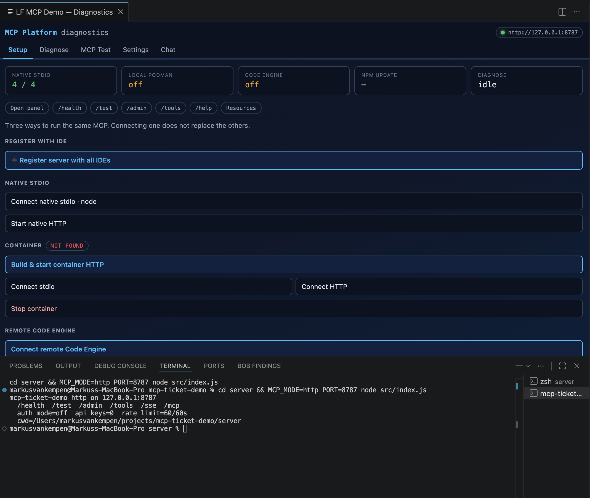
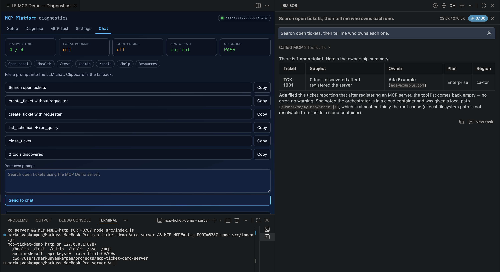
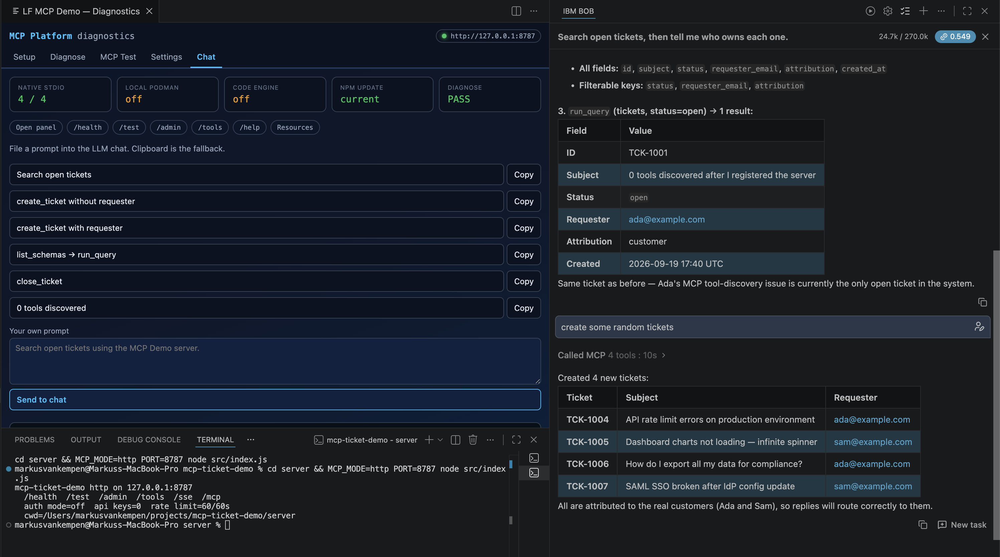
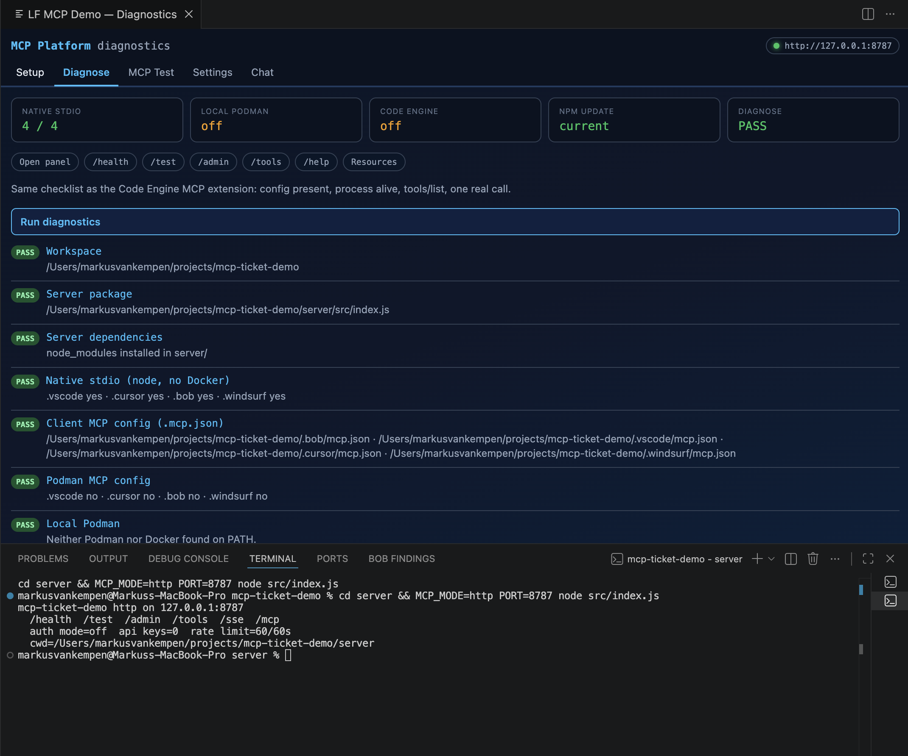
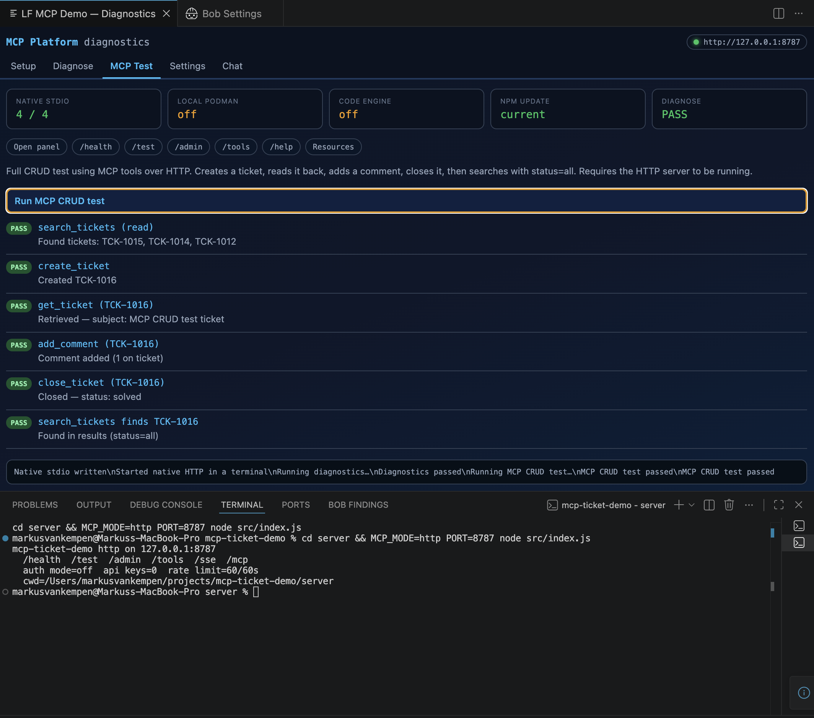
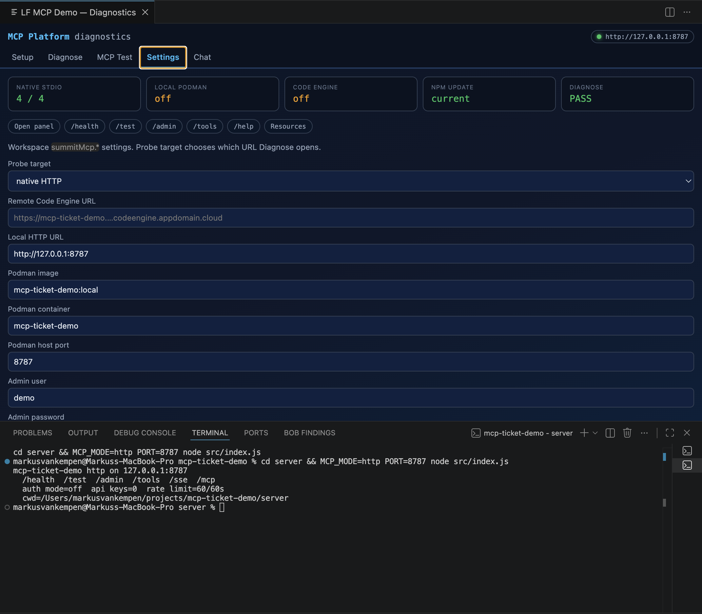

# LF MCP Demo

[](https://marketplace.visualstudio.com/items?itemName=MarkusvanKempen.lf-mcp-summit-demo)
[](https://open-vsx.org/extension/markusvankempen/lf-mcp-summit-demo)
[](https://www.npmjs.com/package/mcp-ticket-demo)
[](https://www.npmjs.com/package/mcp-ticket-demo)
[](https://github.com/markusvankempen/mcp-ticket-demo/blob/main/LICENSE)
[](https://github.com/markusvankempen/mcp-ticket-demo)
[](https://nodejs.org/)
[](https://modelcontextprotocol.io/)

A **control plane and test harness** for the [mcp-ticket-demo](https://www.npmjs.com/package/mcp-ticket-demo) MCP server. The extension manages the server lifecycle, writes IDE config, runs a step-by-step diagnostic, scores tool calls end-to-end, and fires canned prompts directly into your LLM chat — all from a sidebar in VS Code, IBM Bob, Cursor, Windsurf, or Cline. This README describes extension **1.16.0**.

The extension **carries a copy of the MCP server** (`mcp-ticket-demo`, server 3.0.1), so a native stdio connection needs no npm install and no repo clone. The server is a **fully functional support-ticketing backend** with 19 tools (6 for the ticket desk, 8 to operate the server, 3 for timers, 1 for log events and 1 for the machine), three auth modes, four scopes, API key and user management, per-tool gates, rate limiting, and a live `/admin` desk. It runs as a local stdio child process, a local HTTP server, a Podman or Docker container, or a public HTTPS host (for example Render or Code Engine). The **Settings** tab picks which HTTP host Diagnose and CRUD use, and the **Remote HTTP** buttons write that URL into `mcp.json` for chat.

> Companion to [**MCP as a Platform**](https://events.linuxfoundation.org/mcp-dev-summit-toronto/program/schedule/?id=1282401) · MCP Dev Summit Toronto · Oct 2026 — every lesson in the talk is a live, reproducible demo in this repo. · [Talk slides](https://markusvankempen.github.io/linuxfoundation-mcp-dev-summit/#1)

---

## What is included

```
Extension (VS Code / Bob / Cursor / Windsurf / Cline)   ← control plane
├── Setup & Diagnostics panel  (tabs: Setup · Diagnose · MCP Test · Settings · Chat, plus Browser · Remote config · Events when switched on)
│     ├── Step-by-step diagnostic (workspace → config → health → tool call)
│     ├── MCP CRUD test  (create → get → comment → close → search)
│     ├── Tickets table  (id, subject, email, status; filter by status)
│     ├── Connection buttons  (stdio / HTTP / container / Code Engine / other remote)
│     └── Send-to-chat prompts  (fire lesson scenarios into the active LLM)
├── Resources tree  (server status, connection mode, quick links)
├── Status-bar quick menu
└── Bundled server  (extension/server — the same code as the npm package)

MCP Server  (npm: mcp-ticket-demo)              ← what the extension manages
├── 19 tools · 3 resources · 5 prompts
├── Auth  — off / write / all · four scopes · API keys · users · per-tool gates
├── stdio transport  — local child process, no port, secrets in env
├── HTTP transport   — POST /mcp (Streamable)  GET /sse (legacy)  /health  /test  /admin  /tools
└── Container image  — same Dockerfile as the Code Engine deployment
```



---

## Architecture

```
 ┌─────────────────────────────────────────────────────┐
 │  VS Code / Bob / Cursor / Windsurf                  │
 │                                                     │
 │  ┌──────────────────────┐   ┌─────────────────────┐ │
 │  │  LF MCP Demo         │   │   LLM Chat Panel    │ │
 │  │  extension           │──▶│  (Copilot / Bob /   │ │
 │  │                      │   │   Cursor / Cascade) │ │
 │  │  sidebar · tree      │   └─────────────────────┘ │
 │  │  diagnose · prompts  │                           │
 │  └──────────┬───────────┘                           │
 └─────────────┼───────────────────────────────────────┘
               │  MCP  (stdio or HTTP)
   ┌───────────▼───────────────────────────────────┐
   │  mcp-ticket-demo  server                      │
   │                                               │
   │  Transport A — stdio                          │
   │    node  src/index.js  (child process)        │
   │    no port · no URL · secrets in env          │
   │                                               │
   │  Transport B — HTTP                           │
   │    POST /mcp  (Streamable HTTP)               │
   │    GET  /sse  (legacy SSE)                    │
   │    GET  /health  /test  /admin  /tools        │
   │                                               │
   │  Transport C — Podman HTTP                    │
   │    same image as Code Engine                  │
   │    podman run -p 8787:8080 mcp-ticket-demo    │
   │                                               │
   │  Transport D — Remote HTTP                    │
   │    e.g. Render or Code Engine (public HTTPS)  │
   │    POST /mcp · GET /sse · GET /health         │
   └───────────────────────────────────────────────┘
```

---

## Quick start

### Option 1 — Just the extension (no npm, no clone)

Install this extension. The server is already inside it. Open any folder and run
**LF MCP Demo: Connect native stdio** from the command palette (or **Register server with all IDEs**
on the Setup tab). Reload the window so chat picks it up.

The entry it writes runs `node src/index.js` from the server folder inside the extension.
Node 18+ must be on your machine. After an extension update the folder name changes, so on
the next start the extension points existing entries at the new folder and asks you to reload.

### Option 2 — npm

The MCP server is also published at **[npmjs.com/package/mcp-ticket-demo](https://www.npmjs.com/package/mcp-ticket-demo)**.

```bash
npm install -g mcp-ticket-demo   # install globally
# or just run it directly
npx mcp-ticket-demo
```

Use the `npx` entries in the `mcp.json` examples below if you prefer that to the bundled copy.

### Option 3 — Clone the repo

```bash
git clone https://github.com/markusvankempen/mcp-ticket-demo
cd mcp-ticket-demo/server && npm install
```

Open the repo root in VS Code / Bob. The extension prefers `server/src/index.js` in your
workspace over the bundled copy, and all connection commands use it directly. The container
commands also need the `Dockerfile` at the repo root.

### Option 4 — Public host such as Render (no local server)

Deploy the server to a public HTTPS host (Render, Code Engine, or any other) and point the extension at it, for example `https://<your-app>.onrender.com/health`. A deployed server is a **second** ticket store, separate from laptop stdio, and it is empty after a restart or sleep (Render free tier).

1. Open the **Setup** tab → **Remote HTTP** → **Connect other remote HTTP**.
2. Enter `https://<your-app>.onrender.com` (no path, no `/health`). The extension writes `mcp-ticket-demo-remote` at `/mcp`.
3. Reload the window so Copilot / Chat sees it.
4. Open the **Settings** tab and set **Probe target** to `other remote HTTP`, so Diagnose and the CRUD test hit the same host.
5. For writes: sign in to `/admin` on your host (Render generated `ADMIN_PASSWORD`), issue an API key, and set it in VS Code settings as `summitMcp.apiKey`. Run **Connect other remote HTTP** again so the key is written into the `Authorization` header.

**Diagnose and CRUD** use the host chosen by **Probe target** (the panel header shows the URL it is probing). **Chat** uses whatever is in `mcp.json`. They can point at different processes.

**Deploy your own:** `render.yaml` in the repo root is a Render Blueprint (Node in `server/`, not the Docker image). The extension has no deploy button. Use the Render dashboard, then paste the URL into **Connect other remote HTTP**.

---

## mcp.json examples

The extension writes these automatically via **LF MCP Demo: Connect native stdio** etc.,
but you can also paste them manually.

What the extension itself writes for stdio is `command: node` with `args: ["src/index.js"]` and an
absolute `cwd` (the server inside the extension, or your clone). Windsurf ignores `cwd`, so it
gets an absolute path to `src/index.js` instead. The `npx` examples below are the manual,
no-extension equivalent. A real `node` binary is used, never the editor's own helper process.

### VS Code — `.vscode/mcp.json`

**stdio (npx — no clone needed)**
```json
{
  "servers": {
    "mcp-ticket-demo": {
      "type": "stdio",
      "command": "npx",
      "args": ["mcp-ticket-demo"],
      "env": { "MCP_MODE": "stdio" }
    }
  }
}
```

**stdio (local clone)**
```json
{
  "servers": {
    "mcp-ticket-demo": {
      "type": "stdio",
      "command": "node",
      "args": ["src/index.js"],
      "cwd": "/path/to/mcp-ticket-demo/server",
      "env": { "MCP_MODE": "stdio" }
    }
  }
}
```

**Remote HTTP (any public host, e.g. Render or Code Engine)**
```json
{
  "servers": {
    "mcp-ticket-demo-remote": {
      "type": "http",
      "url": "https://<your-app>.onrender.com/mcp",
      "headers": { "Authorization": "Bearer mcpk_your_api_key" }
    }
  }
}
```

Same shape for Code Engine — swap the host for `https://<app>.codeengine.appdomain.cloud/mcp`.
Leave `headers` out while the server's auth mode is `off`. Never send a made-up token: the
server reads every Bearer value as an API key and answers `401` to one it does not know.

---

### IBM Bob — `.bob/mcp.json`

**stdio (npx)**
```json
{
  "mcpServers": {
    "mcp-ticket-demo": {
      "command": "npx",
      "args": ["mcp-ticket-demo"],
      "env": { "MCP_MODE": "stdio" },
      "alwaysAllow": [
        "describe_server", "create_ticket", "add_comment",
        "close_ticket", "get_schema", "run_query"
      ],
      "disabled": false
    }
  }
}
```

**Remote HTTP (any public host, e.g. Render or Code Engine)**
```json
{
  "mcpServers": {
    "mcp-ticket-demo-remote": {
      "type": "streamable-http",
      "url": "https://<your-app>.onrender.com/mcp",
      "alwaysAllow": [
        "describe_server", "create_ticket", "add_comment",
        "close_ticket", "get_schema", "run_query"
      ],
      "disabled": false
    }
  }
}
```

---

### Cursor — `.cursor/mcp.json`

**stdio (npx)**
```json
{
  "mcpServers": {
    "mcp-ticket-demo": {
      "command": "npx",
      "args": ["mcp-ticket-demo"],
      "env": { "MCP_MODE": "stdio" }
    }
  }
}
```

**Remote Streamable HTTP**
```json
{
  "mcpServers": {
    "mcp-ticket-demo-remote": {
      "url": "https://<your-app>.onrender.com/mcp",
      "headers": { "Authorization": "Bearer mcpk_your_api_key" }
    }
  }
}
```

---

### Windsurf — `~/.codeium/windsurf/mcp_config.json`

Windsurf has **no per-project MCP config** — it reads one global file. The extension
writes it only when Windsurf is installed (`~/.codeium/windsurf/` exists), and never
from auto-connect. Remote servers use `serverUrl`, not `url`.

**stdio (npx)**
```json
{
  "mcpServers": {
    "mcp-ticket-demo": {
      "command": "npx",
      "args": ["mcp-ticket-demo"],
      "env": { "MCP_MODE": "stdio" }
    }
  }
}
```

**Remote HTTP (Streamable HTTP)**
```json
{
  "mcpServers": {
    "mcp-ticket-demo-remote": {
      "serverUrl": "https://<your-app>.onrender.com/mcp"
    }
  }
}
```

---

### Cline — `cline_mcp_settings.json`

Cline does **not** read `.vscode/settings.json`. Current builds use
`~/.cline/data/settings/cline_mcp_settings.json`; older builds keep it in the IDE's
global storage (`…/User/globalStorage/saoudrizwan.claude-dev/settings/`). The extension
writes whichever exists, only when Cline is installed, and never from auto-connect.
Remote servers need `"type": "streamableHttp"` (camelCase) — without it Cline falls back
to legacy SSE.

**stdio (npx)**
```json
{
  "mcpServers": {
    "mcp-ticket-demo": {
      "command": "npx",
      "args": ["mcp-ticket-demo"],
      "env": { "MCP_MODE": "stdio" },
      "autoApprove": [
        "describe_server", "create_ticket", "add_comment",
        "close_ticket", "get_schema", "run_query"
      ],
      "disabled": false
    }
  }
}
```

**Remote HTTP (Streamable HTTP)**
```json
{
  "mcpServers": {
    "mcp-ticket-demo-remote": {
      "type": "streamableHttp",
      "url": "https://<your-app>.onrender.com/mcp",
      "disabled": false
    }
  }
}
```

---

### With API key (auth mode: write or all)

Add to any `env` block for stdio, or add a `headers` block for HTTP.

**stdio.** A stdio server has no `/admin` to issue a key from, so register one in the server's
own env (`API_KEY`) and present the same value (`MCP_API_KEY`). This is what the extension
writes when `summitMcp.apiKey` is set:
```json
"env": {
  "MCP_MODE": "stdio",
  "AUTH_MODE": "write",
  "API_KEY": "mcpk_your_key",
  "API_KEY_SCOPES": "read,write,pii",
  "MCP_API_KEY": "mcpk_your_key"
}
```

**HTTP (any client).** Issue the key on `/admin → API Keys`, then send it as a header:
```json
"headers": {
  "Authorization": "Bearer mcpk_your_key"
}
```

> Set the auth mode on `/admin → Security`, with the `summitMcp.authMode` setting (the
> mode the server starts with), or with the `update_settings` tool (`authMode`).
>
> **Admin tools need an `admin` scope.** The stdio entry the extension writes grants
> `read,write,pii`, so the operating tools (`update_settings`, `issue_api_key`, …) are refused
> there. Use `/admin`, or give the key `admin` in `API_KEY_SCOPES` yourself.

---

## Connection modes

```
┌──────────────────────┬───────────────────────────────────────────────────┐
│ Mode                 │ How it works                                      │
├──────────────────────┼───────────────────────────────────────────────────┤
│ Native stdio         │ node src/index.js  spawned as a child process.    │
│                      │ No port. No URL. Credentials go in process env.   │
│                      │ Fastest for local dev.                            │
├──────────────────────┼───────────────────────────────────────────────────┤
│ Native HTTP          │ node src/index.js  runs an Express server on      │
│                      │ the port in summitMcp.localHttpUrl (8787).        │
│                      │ Use /health /test /admin /mcp. Start it with      │
│                      │ "Start native HTTP server"; your auth mode and    │
│                      │ API key are passed to the process. Run "Connect   │
│                      │ native HTTP" so chat uses this same process.      │
├──────────────────────┼───────────────────────────────────────────────────┤
│ Podman stdio         │ podman run -i --rm  spawns the container as a     │
│                      │ stdio child. Same MCP_MODE=stdio path.            │
├──────────────────────┼───────────────────────────────────────────────────┤
│ Podman HTTP          │ Container maps port 8787 → 8080.                  │
│                      │ IDE connects to http://127.0.0.1:8787/mcp.        │
├──────────────────────┼───────────────────────────────────────────────────┤
│ Remote HTTP          │ Public HTTPS, e.g. Render or Code Engine.         │
│                      │ Every client connects to /mcp (Streamable HTTP).  │
│                      │ Example: https://<your-app>.onrender.com          │
│                      │ Diagnose/CRUD use summitMcp.probeTarget + URL.    │
└──────────────────────┴───────────────────────────────────────────────────┘
```

> **One process, one ticket store.** The data lives in memory inside each server process.
> Native stdio gives chat its own private process, so tickets made in chat do **not** appear
> on `/admin`, and Diagnose and the CRUD test (which call the HTTP server) never see them.
> To make chat, `/admin` and Diagnose share one store, run **Start native HTTP server**, then
> **Connect native HTTP**, and reload the window. The extension watches for this: when a local
> HTTP server is up and a chat client points elsewhere, it shows a notification with a one-click
> fix (choose "Don't ask again" to silence it for this workspace), and Diagnose fails the
> "Chat uses this server" step.

---

## MCP Tools (19 total)

Six tools are the ticket desk. Eight more operate the server. Three are timers, one is an event (`push_log`), and `watch_system` publishes the machine. Reads go through `run_query`: `tickets`, `customers`, `assets`, `timers`, `system`, `settings`, `events`, and with admin `users`, `api_keys`, `trace`, `errors` and `counters` (12 schemas). There is no `search_tickets`, `get_ticket`, `lookup_customer` or `get_settings` tool. `describe_server` lists every one,
and which of them you may call right now.

### Ticket desk

```
┌──────────────────┬───────────┬────────────────────────────────────────────┐
│ Tool             │ Scope     │ Purpose                                    │
├──────────────────┼───────────┼────────────────────────────────────────────┤
│ describe_server  │ read      │ Identity, auth mode, your scopes, rate     │
│                  │           │ limit, and the full tool inventory.        │
│                  │           │ Call this first when anything is denied.   │
├──────────────────┼───────────┼────────────────────────────────────────────┤
│ create_ticket    │ write     │ Open a ticket. ALWAYS pass requester_email │
│                  │           │ or the service account owns it and every   │
│                  │           │ reply goes to the bot.                     │
├──────────────────┼───────────┼────────────────────────────────────────────┤
│ add_comment      │ write     │ Comment on a known ticket id.              │
├──────────────────┼───────────┼────────────────────────────────────────────┤
│ close_ticket     │ write     │ Resolve a ticket. Optional resolution note │
│                  │           │ becomes the last comment.                  │
├──────────────────┼───────────┼────────────────────────────────────────────┤
│ get_schema       │ read      │ Discovery. No name lists every name with a │
│                  │           │ kind (data, query or tool); a name gives   │
│                  │           │ that shape or tool's arguments. Runs       │
│                  │           │ nothing. Then call the tool.               │
├──────────────────┼───────────┼────────────────────────────────────────────┤
│ run_query        │ read      │ The one read tool for data. schema=tickets │
│                  │           │ finds tickets (status, requester_email,    │
│                  │           │ query) or one ticket by id with body and   │
│                  │           │ comments. schema=customers reads a         │
│                  │           │ customer; phone is REDACTED unless the     │
│                  │           │ caller holds the pii scope. Also assets,   │
│                  │           │ timers, system, settings, events, and for  │
│                  │           │ admin users, api_keys, trace, errors,      │
│                  │           │ counters. Do not invent query_tickets.     │
└──────────────────┴───────────┴────────────────────────────────────────────┘
```

### Operating the server

```
update_settings                                      (admin; one patch changes any setting:
                                                      authMode, rateLimit, audit, uiAuth, protocols, events,
                                                      toolGates, toolAuthOverrides, toolScopeOverrides)
set_mqtt                                             (admin, publishes events to an MQTT broker)
create_user · delete_user                            (admin; list with run_query schema=users)
issue_api_key · revoke_api_key                       (admin; list with run_query schema=api_keys)
import_settings                                      (admin; export is run_query schema=settings)
generate_traffic                                     (read, any credential)
read the trace / errors / counters: run_query        (admin; schema=trace | errors | counters)
```

### Timers

```
start_timer · stop_timer · push_timer                (read)
read a timer:  run_query  schema=timers              (there is no get_timer)
```

Start a countdown with `seconds`, or a stopwatch without it. `state`, `elapsed_ms` and `remaining_ms` are worked out when you query. Timers live in memory and are lost on a restart. `push_timer` makes a running timer report its time as events.

### Events

```
push_log                                             (write)
choose what is announced: update_settings events     (admin)
```

The server can stream what happens on it (tickets, timers, log lines, settings) to a listening client as MCP log notifications, over SSE or Streamable HTTP, and can publish the same events to an MQTT broker. **Off by default.** The **Events** tab (command *LF MCP Demo: Events*, or **Events** in the tree under Control plane) does all of it:

- **Listen live.** A webview cannot hold a stream open, so the extension host opens it (with the server's own `events-client.js`) and hands every event to the tab. Both transports (Streamable HTTP, legacy SSE), an events filter, a topic filter, and a **Minimum level** that sends `logging/setLevel` on that connection. At most four streams at once; they close with the tab.
- **Choose what is announced**, send a line (with a level), push a timer (choose Countdown or Clock, how long it runs and how often it reports; 30 s every 5 s to start), open a test ticket, and **Run the demo** (events on, listen, the timer you set reporting its time).
- **MQTT.** Broker URL, topic prefix, user, password (kept on the server, never shown again), QoS, retain, and **Send a test message**. See the [server README](../server/README.md#mqtt).
- **Test the subscription** opens a stream with its own topic, sends a line with `push_log` and checks it arrives.

The tab uses the **Connection** on the **Remote config** tab: the server this extension probes with the admin user from Settings, or any URL you give it (a remote URL gets no password from here). The full list of kinds and the stream formats are in the [server README](../server/README.md#events). The extension does not auto-approve these tools. Timer events need no admin credential: `push_timer` switches them on itself. For log lines and tickets, `update_settings` (events) needs an admin credential, or start the server with `ANNOUNCE_EVENTS=on`. Details and a troubleshooting table are in the [server README](../server/README.md#getting-events-to-flow).

The extension auto-approves only the six ticket-desk tools in Bob
(`alwaysAllow`) and Cline (`autoApprove`). The admin tools still ask first.

### Queryable schemas

`get_schema` with no name marks each name as `data` (a shape: `server`, `ticket`, `customer`),
`query` (the only names `run_query` takes: `tickets`, `customers`, `assets`, `timers`, `system`, `settings`, `events`, and with admin `users`, `api_keys`, `trace`, `errors` and `counters`) or `tool`
(the argument shape of any tool). A shape is never a tool, and a tool is never a `run_query` name.

```
tickets    id · subject · status · requester_email · attribution · created_at
           filterable: id · status · requester_email · attribution · query
           (id returns every field, with body and comments; a list returns the short fields;
            no status filter lists every ticket, newest first; limit up to 50, default 10)

customers  email · name · plan · region · phone (REDACTED without the pii scope)
           filterable: email · region

assets     id · name · site · status
           filterable: status · site
```

---

## Auth model

```
┌──────────┬──────────────────────────────────────────────────────────┐
│ Mode     │ Effect                                                   │
├──────────┼──────────────────────────────────────────────────────────┤
│ off      │ All tools callable. No credential needed. Default.       │
├──────────┼──────────────────────────────────────────────────────────┤
│ write    │ read tools open. write tools need a credential.          │
├──────────┼──────────────────────────────────────────────────────────┤
│ all      │ Every tool call requires a credential.                   │
└──────────┴──────────────────────────────────────────────────────────┘

Scopes
  read   schemas, run_query (tickets, customers, settings, ...)
  write  create_ticket, add_comment, close_ticket                    (includes read)
  pii    shows the customer phone in run_query (no tool needs it)    (includes read)
  admin  everything, including set_*, users, keys, import/export

Accepted credentials
  HTTP  →  Authorization: Bearer <api key>
           Authorization: Basic base64(user:pass)
           x-api-key: <api key>

  stdio →  MCP_API_KEY=<key>  in server process env
           MCP_USERNAME + MCP_PASSWORD  in server process env

Issue API keys on  /admin → API Keys.
Switch mode from   /admin → Security  or summitMcp.authMode setting.

An unknown key is refused with 401 even when the mode is off (describe_server
is exempt). Send a real key, or send nothing.
```

---

## Send-to-chat prompts

The sidebar and panel include one-click prompts that fire directly
into the active LLM chat (VS Code Copilot, IBM Bob, Cursor, Windsurf Cascade).
Clipboard fallback is automatic when the chat API is not exposed.

```
1.  Discover the server
    "Call describe_server. Tell me the auth mode, my scopes,
     rate-limit budget, and which tools need a credential."

2.  Search open tickets
    "Search open tickets, then tell me who owns each one."

3.  create_ticket without requester  ← the attribution-scar lesson
    "Create a ticket … do not pass requester_email.
     Then tell me who owns it."

4.  create_ticket with requester
    "Create a ticket for ada@example.com …
     Then search tickets owned by ada@example.com."

5.  add_comment on a ticket
    "Search open tickets, pick one, then add a comment as
     support@example.com explaining what you found."

6.  close_ticket
    "Search open tickets, pick one, then close_ticket with a
     short resolution note. Tell me the new status and resolved_at."

7.  get_schema → run_query  ← the schema-discovery lesson
    "List schemas, get the tickets schema,
     then run_query on tickets filtered to status=open."

8.  PII gating on run_query customers
    "Call run_query with schema=customers and filter email=ada@example.com.
     Is the phone number visible? Explain why or why not."

9.  Auth modes & scopes
    "Call describe_server and tell me the current auth mode,
     which tools are locked, and what scope each write tool requires."

10. Tools reported vs tools visible  ← the silent-failure lesson
    "Call describe_server and read tool_count. Count the tools you
     can actually call. If they differ, name the missing tools and
     say why: a gate or lock, a client allow-list, a stale connection."
    (A chat that sees zero tools cannot run any prompt. For the empty
     list itself, use Diagnose and docs/DEMO.md.)

11. Typed tool results  (server 2.0.0+)
    "Call run_query with schema=tickets and filter status=open. Using only the result's
     fields, list the top-level field names, the field names on one
     ticket, and quote the next field word for word."

12. outputSchema — a tool's return shape  (server 2.0.0+)
    "Call get_schema with name run_query and list the properties
     of its outputSchema. Then call run_query on tickets and check the result
     has exactly those fields."

13. Resources — ticket://{id}  (server 2.0.0+)
    "Read the MCP resource tickets://open, then ticket://TCK-1001.
     If this chat cannot read MCP resources, say so and use
     run_query with schema=tickets instead."
    (completion/complete is a protocol message a chat cannot send.
     Diagnose runs it: "completion/complete (argument hints)".)
```

> **Prompt 3 and the server's instructions.** The server tells every model to pass
> `requester_email`, and `create_ticket`'s description says the same. A chat model told to
> leave it out may add one anyway. To reproduce the scar every time, call `create_ticket`
> yourself: **▶ Try** on the server's `/tools` page, `/admin`, or the curl block on `/help`.





### Chat delivery chain

```
prompt text
    │
    ├─▶ 1. workbench.action.chat.open  { query, submit }   VS Code Copilot
    ├─▶ 2. inlineChat.start            { query }           VS Code inline
    ├─▶ 3. Bob.focus → paste → Bob.acceptInput             IBM Bob
    ├─▶ 4. windsurf.openCascade        { query }           Windsurf
    ├─▶ 5. aichat.newchataction        { query }           Cursor AI Chat
    ├─▶ 6. composer.startComposer      { query }           Cursor Composer
    ├─▶ 7. workbench.action.chat.newChat → paste → submit  Generic fallback
    └─▶ 8. clipboard + info message                        Last resort
```

---

## Diagnostics

Run **MCP Demo: Diagnose** to execute a full health sweep:

```
Step                             What is checked
──────────────────────────────────────────────────────────────────────────
Workspace                        Folder is open
Server package                   server/src/index.js exists (workspace clone or the bundled copy)
Server dependencies              node_modules installed
mcp-ticket-demo entry in chat    Which clients have an entry and whether each is stdio or http
Client MCP config                At least one mcp.json present
Podman MCP config                Podman entry present (when probe=podman)
Local Podman / Podman container  runtime version, container status
GET /health                      HTTP 200, version, tool count (`cwd` on localhost only)
Running server matches           /health version equals the server code on disk. A stale local
                                 process fails; a public host is only reported
Chat and /admin share one server The editor you are in (VS Code, Cursor, Bob) reaches the server
                                 Diagnose probes. A stdio entry is a private process with its
                                 own tickets, so it fails here (fix: Connect native HTTP).
                                 Other editors' configs are only mentioned, not failed
GET /test                        Public read-only smoke passed
tools/list                       At least 1 tool returned (the silent failure)
run_query (tickets)              Real call returns TCK- ids
outputSchema (structured results) run_query exposes outputSchema (server 2.0.0+)
completion/complete               ticket://{id} completes with TCK-100x ids (server 2.0.0+)
npm version                      Local version vs npm latest
```



**MCP Demo: Run MCP CRUD test** (panel → MCP Test tab) creates a ticket, reads it, comments, closes it, then finds it again by subject. The **Test ticket** fields set the subject, body and requester email (blank uses the default), and **Status at the end** chooses `solved` (calls `close_ticket`) or `open` (skips it); MCP has no tool that sets any other status.

Below it, **Tickets** lists every ticket on the probe server in a table (id, subject, requester email, status), newest first and up to 50, read with `run_query` `schema=tickets`. The **Status** filter (all, open, pending, solved) reloads the table as you change it, and the table refreshes after each CRUD run. It scores the tool JSON (`ok`, `ticket.id`, `status`), not HTTP 200. When the probe host is not local (Render, Code Engine, any remote URL) it asks first, because it writes a real ticket that other people can see.

Diagnose and the CRUD test both send `summitMcp.apiKey` as `Authorization: Bearer`, so they work against a server in auth mode `all`.



### Browser tab — a web page calling the server

*Advanced tab, hidden by default. Switch it on under **Settings → Advanced tabs** (`summitMcp.showBrowserTab`).*

A browser sends an `Origin` header with every cross-site call, and the server answers only for localhost, its own host, or an origin listed in `CORS_ORIGINS`. Editors, curl and Claude send no origin, so this only matters for web pages. The tab shows the probe server's MCP URL and whether a key is set, and lets you:

- **Set allowed origins.** `summitMcp.corsOrigins` (comma-separated, scheme and host only) is passed as `CORS_ORIGINS` when the extension starts the native HTTP server or the container. Restart it to apply. A deployed server (Render, Code Engine, any host) needs the same variable in its own environment: **Copy CORS_ORIGINS line** copies it.
- **Test it.** **Run browser test** sends a preflight and a real `run_query` call with the origin you enter, then checks that an unlisted site is refused. Each step says what to change. It is read-only, so it is safe against a shared host.
- **Open the browser client** (`/clients/browser.html` on the probe server; it has forms for the rate limit, users and API keys, and can call every tool) or **copy a `fetch()` snippet** with the probe URL. The snippet uses a `<your-api-key>` placeholder, never your real key.

### Remote config tab — manage a server over MCP

*Advanced tab, hidden by default. Switch it on under **Settings → Advanced tabs** (`summitMcp.showRemoteConfigTab`), or run **LF MCP Demo: Remote config**, which turns it on for you.*

The **Remote config** tab (also **LF MCP Demo: Remote config** in the Command Palette and the Resources tree, under Control plane) configures the probe server, or any deployed one, without leaving the editor. It is the same page as **Admin → Remote config** on the server's `/admin` desk, running inside the panel:

- **Connection.** The MCP URL follows the probe server. The bearer key is filled from `summitMcp.apiKey`. A local server also gets the admin user from Settings (`demo` / `demo` by default), so it works on first use; a remote URL never gets a password from the extension. A key wins over a username, so clear it to sign in with a username. Anything you type is kept, and nothing is saved.
- **Demo setup.** **Apply demo setup** creates four users (`demo-reader`, `demo-writer`, `demo-pii`, `demo-admin`, password `demo-pass`) and four labelled API keys, turns the call trace on, records sample traffic, sets auth mode `write` and the rate limit to 30 per 60 s. **Check demo setup** signs in as each role and as nobody and tests who can read, write, see PII and use admin tools. **Remove demo setup** restores auth off, 60 per 60 s and trace off. Apply and Remove ask in a dialog first.
- **Rate limit and call trace**, **users and API keys** (list, create, delete, revoke, with a one-time key box), a **self-test** that creates and removes a throwaway user and key, and **Any tool**, a form built from each tool's schema.

A webview may not call the network itself, so the extension makes every request from its own process and hands the reply back. That also means no CORS setup is needed here; the **Browser** tab above is for web pages. Dialogs and Copy go through the editor too.

The same operations are available from a terminal. The packed server is also a command line client: `node <extension folder>/server/src/index.js status --url http://127.0.0.1:8787` or, with Node on the path, `npx mcp-ticket-demo demo check --user demo --password-stdin`. **LF MCP Demo: Open command line page** (and **Command line** under Pages in the Resources tree) opens `/clients/cli.html` on the probe server with the commands to copy. The demo setup there and the one on this tab are the same steps, so one can check what the other applied.

The page script is the server's own `server/src/remote-config.client.js`, so the two stay identical. Run `npm test` in `extension/` for the checks (the markup, the message contract, the network layer, a full Apply, Check and Remove against a live server, and the Events tab: the host opens real streams, applies the logging level and passes the credential), and `npm run preview` to open the webview in a normal browser at `http://127.0.0.1:8830/` while working on its layout.

---

## Commands

```
LF MCP Demo: Discover mcp.json          Scan workspace for existing configs
LF MCP Demo: Connect native stdio        Write node entry to all client configs
LF MCP Demo: Connect native HTTP         Point chat at the native HTTP server (replaces the stdio entry), so chat,
                                         /admin and Diagnose all share one ticket store
LF MCP Demo: Connect remote HTTP         Prompt for hosting URL, write a Streamable HTTP entry at /mcp
LF MCP Demo: Connect Code Engine         Write mcp-ticket-demo-codeengine (/mcp) for your Code Engine app
LF MCP Demo: Connect container stdio     Write podman/docker run -i entry
LF MCP Demo: Connect container HTTP      Write container HTTP entry
LF MCP Demo: Build & start local container  build + run in one step (127.0.0.1 only; needs the repo's Dockerfile or a built image)
LF MCP Demo: Stop local container        Stop the running container
LF MCP Demo: Start native HTTP server    Terminal in the server folder, MCP_MODE=http on the localHttpUrl port,
                                         with your auth mode and API key
LF MCP Demo: Diagnose                    Full health sweep + panel
LF MCP Demo: Open diagnostics panel      Panel without running diagnostics
LF MCP Demo: Send prompt to chat         Prompt picker → fire into LLM chat
LF MCP Demo: Chat — search open tickets  One-click canned prompt
LF MCP Demo: Save settings               Persist sidebar form values
LF MCP Demo: Open /health                Open in browser
LF MCP Demo: Open /test                  Open in browser
LF MCP Demo: Open /admin                 Open in browser
LF MCP Demo: Open /tools                 Open in browser
LF MCP Demo: Open /help                  Open in browser
LF MCP Demo: Open mcp.json               Show the written config file
LF MCP Demo: Show quick menu             Status-bar shortcut menu
LF MCP Demo: Register server with all IDEs  Write VS Code, Cursor, Bob (+ Windsurf / Cline if installed)
LF MCP Demo: Run MCP CRUD test           create → get → comment → close → search (asks first on remote hosts)
LF MCP Demo: Remote config (rate limit, users, API keys, demo setup)  opens the Remote config tab
LF MCP Demo: Test browser access (CORS)  preflight + run_query as a web page origin, plus a refused-site check
LF MCP Demo: Open browser client page    /clients/browser.html on the probe server
LF MCP Demo: Open command line page     /clients/cli.html on the probe server (npx mcp-ticket-demo commands)
LF MCP Demo: Copy browser fetch snippet  fetch() for the probe MCP URL (key left as a placeholder)
LF MCP Demo: Copy CORS_ORIGINS line      CORS_ORIGINS=... for a deployed server's environment
LF MCP Demo: Install bundled server      Confirms the server packed in the extension. Installs from npm
                                         into global storage only if this build has none
LF MCP Demo: Update server from npm      Only for builds without the packed server. Otherwise it says
                                         to update the extension
Refresh                                  Reload the Resources tree
```

---

## Settings



```
summitMcp.probeTarget      auto | native-http | podman | remote | codeengine
                           Which HTTP host Diagnose, CRUD, and /health use.
                           Set on Settings → Probe target.

summitMcp.remoteUrl        Other public hosting URL, no path
                           (https://<your-app>.onrender.com).
                           Server id: mcp-ticket-demo-remote.

summitMcp.codeEngineUrl    Code Engine origin, no path. Default:
                           empty (paste your deployed URL).
                           Server id: mcp-ticket-demo-codeengine.
                           probeTarget codeengine points Diagnose/CRUD here.

summitMcp.localHttpUrl     Local HTTP URL. Default: http://127.0.0.1:8787

summitMcp.podmanImage      Image name. Default: mcp-ticket-demo:local

summitMcp.podmanContainer  Container name. Default: mcp-ticket-demo

summitMcp.podmanPort       Host port mapped to container 8080. Default: 8787

summitMcp.adminUser        /admin username. Default: demo

summitMcp.adminPassword    /admin password. Change before sharing.

summitMcp.apiKey           API key issued on /admin → API Keys.
                           Sent as Authorization: Bearer over HTTP, and given
                           to stdio / native HTTP / Podman processes as
                           API_KEY + MCP_API_KEY (scopes read,write,pii).
                           Also on the panel's Settings tab, which saves it to
                           your user settings (not the workspace, so it stays
                           out of a committed .vscode/settings.json).
                           Re-run the Connect command after you change it.

summitMcp.corsOrigins      Web-page origins allowed to call the HTTP server from a
                           browser, comma-separated (https://app.example.com).
                           Passed as CORS_ORIGINS when the extension starts the
                           native HTTP server or the container; restart to apply.
                           Localhost and the server's own host are always allowed.

summitMcp.autoConnectStdio true (default)
                           Write native stdio into .vscode / .cursor / .bob
                           on activate if missing — only when the workspace
                           is the repo clone. Never overwrites HTTP/SSE and
                           never touches the global Windsurf / Cline files.
                           Separately, entries that already exist but point
                           at an old extension folder are repaired on every
                           activate.

summitMcp.authMode         off | write | all
                           Auth mode the stdio, native HTTP and Podman
                           processes boot with. Also on the Settings tab.

summitMcp.showBrowserTab        false (default)
summitMcp.showRemoteConfigTab   false (default)
summitMcp.showEventsTab         false (default)
                           Advanced tabs. Each is hidden until switched on:
                           the tab, its tree entries (Browser client, Test
                           browser access, Remote config, Events) and its quick
                           menu items. Tick them under Settings → Advanced tabs,
                           or set them in settings.json; both take effect at
                           once. They are user settings, so they follow you to
                           every workspace. Running a command that belongs to a
                           hidden tab (LF MCP Demo: Remote config, Events, Test
                           browser access) turns that tab on and says so.
```

The panel's **Settings** tab edits probe target, the remote, Code Engine and local URLs, the Podman
image, container and port, the admin user and password, the API key and the auth mode, and the
auto-connect checkbox, and it holds the **Advanced tabs** switches (Browser, Remote config and
Events, all off by default). After
changing the key or mode, run the Connect command again so the config files pick it up.

---

## HTTP endpoints (local HTTP, Podman, and Render)

```
GET  /health         Liveness. Version, tool count. `cwd` only on localhost.
GET  /test           Read-only smoke. `/test?write=1` after admin sign-in creates + closes.
GET  /admin          Admin desk — security, API keys, tool gates, lab, data, users.
GET  /log            Tool counters, audit trail, call trace (admin sign-in).
GET  /tools          Tool inventory page, with a ▶ Try button per tool.
GET  /help           Setup instructions.
GET  /clients/       Copy-paste setup pages for each editor, a browser client, and the command line.
POST /mcp            Streamable HTTP MCP transport (JSON-RPC 2.0).
GET  /sse            Legacy SSE MCP transport (update_settings protocols can turn it off).
```

The desk pages have a project / light / dark theme switch in the header.

---

## Client compatibility

```
┌─────────────────┬────────┬──────────┬────────────┬─────────┐
│                 │ stdio  │ HTTP/SSE │ Streamable │ Podman  │
│                 │        │          │ HTTP       │ stdio   │
├─────────────────┼────────┼──────────┼────────────┼─────────┤
│ VS Code Copilot │  yes   │  SSE     │    yes     │  yes    │
│ IBM Bob         │  yes   │  —       │    yes     │  yes    │
│ Cursor          │  yes   │  —       │    yes     │  yes    │
│ Windsurf        │  yes   │  —       │    yes     │  yes    │
│ Cline           │  yes   │  SSE     │    yes     │  yes    │
└─────────────────┴────────┴──────────┴────────────┴─────────┘
```

Every client's HTTP entry points at `/mcp` (Streamable HTTP). The extension writes
no SSE entry and no `uvx mcp-proxy` shim. When `summitMcp.apiKey` is set, it goes
in an `Authorization: Bearer` header.

---

## MCP server — standalone use

The server is published separately on npm as `mcp-ticket-demo`.

```bash
# stdio (default)
npx mcp-ticket-demo

# HTTP
MCP_MODE=http npx mcp-ticket-demo

# With auth: API_KEY registers a key at boot (default scopes read,write)
AUTH_MODE=write API_KEY=mykey MCP_MODE=http npx mcp-ticket-demo
# then call with: Authorization: Bearer mykey
```

`PORT` defaults to 8080 when you leave it out. From a clone, `npm run http` in `server/` uses 8787.
The server's own README lists every endpoint, tool, scope and environment variable.

---

## Talk lessons this demo is built around

```
Lesson 1 — The silent tool-count failure
  tools/list returns 0 tools with no error when the server starts
  but the cwd is wrong or MCP_MODE is unset. The diagnostic step
  reproduces this exactly.

Lesson 2 — Attribution scar
  create_ticket without requester_email returns HTTP 201.
  The ticket exists. The API call "succeeded". But the service
  account owns it and every reply goes to the bot, not the customer.
  The create_ticket prompt demonstrates this in one LLM turn.

Lesson 3 — Schema discovery over tool proliferation
  get_schema → run_query replaces a pile of
  query_tickets / query_assets / query_with_filter tools.
  The model discovers the shape; the server exposes one tool.
  Each name carries a kind (data, query, tool) so a shape is
  never mistaken for a tool.

Lesson 4 — Laptop paths don't survive a container boundary
  Native stdio uses cwd: serverDir() (absolute, local).
  Podman stdio uses the image — no absolute path.
  Code Engine and Render use the image or a public process — no laptop cwd.
  The "mcp.json worked yesterday, 404 today" seed ticket (TCK-1003)
  illustrates the hostname rotation problem on managed platforms.
```

---

**Author:** Markus van Kempen ·
[markus.van.kempen@gmail.com](mailto:markus.van.kempen@gmail.com) ·
[markusvankempen.github.io](https://markusvankempen.github.io/) ·
[MCP Dev Summit Talk](https://events.linuxfoundation.org/mcp-dev-summit-toronto/program/schedule/?id=1282401) ·
[Talk slides](https://markusvankempen.github.io/linuxfoundation-mcp-dev-summit/#1)

*Personal open-source demo.*
