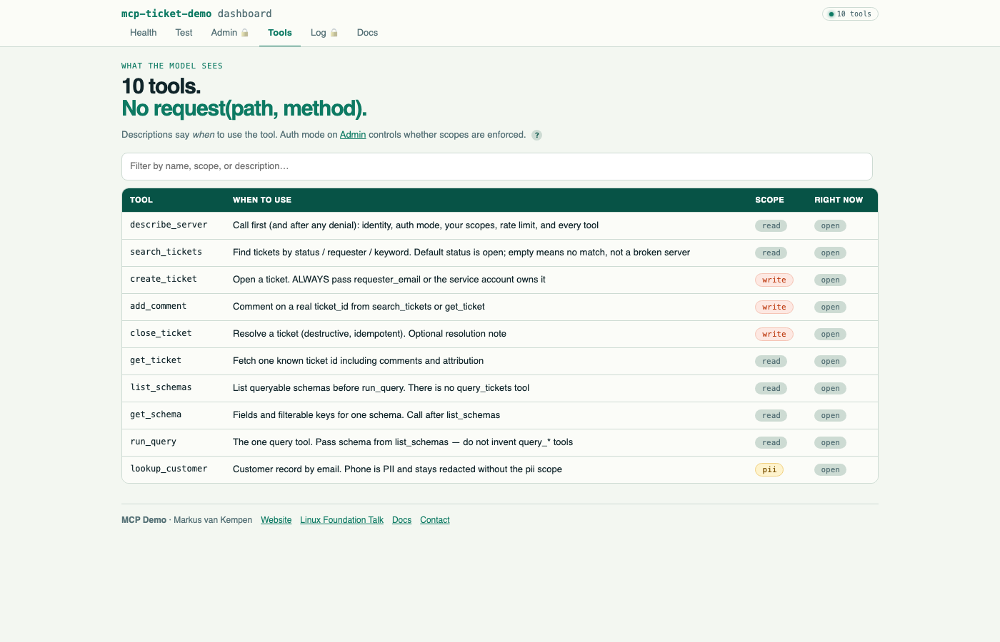
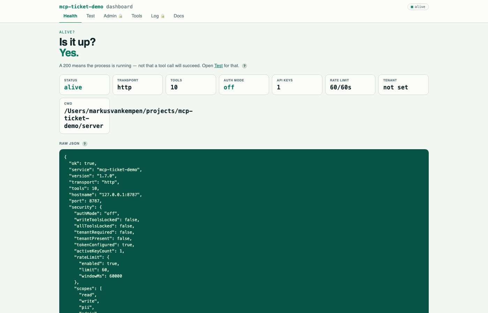
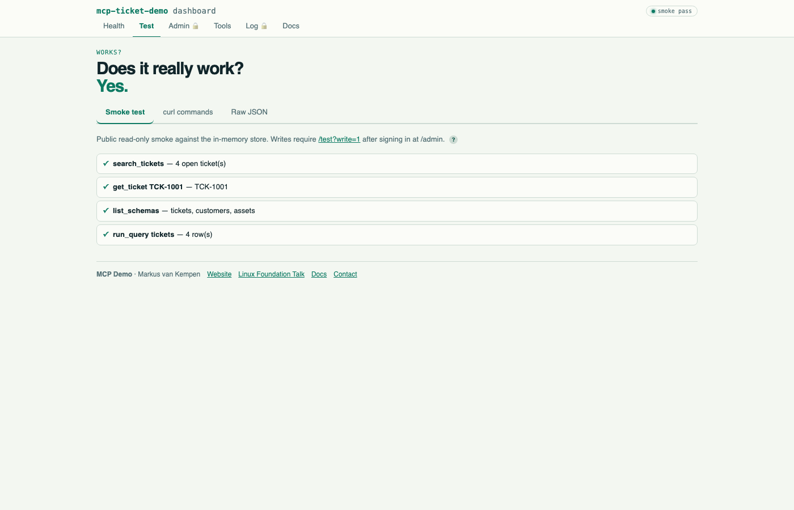
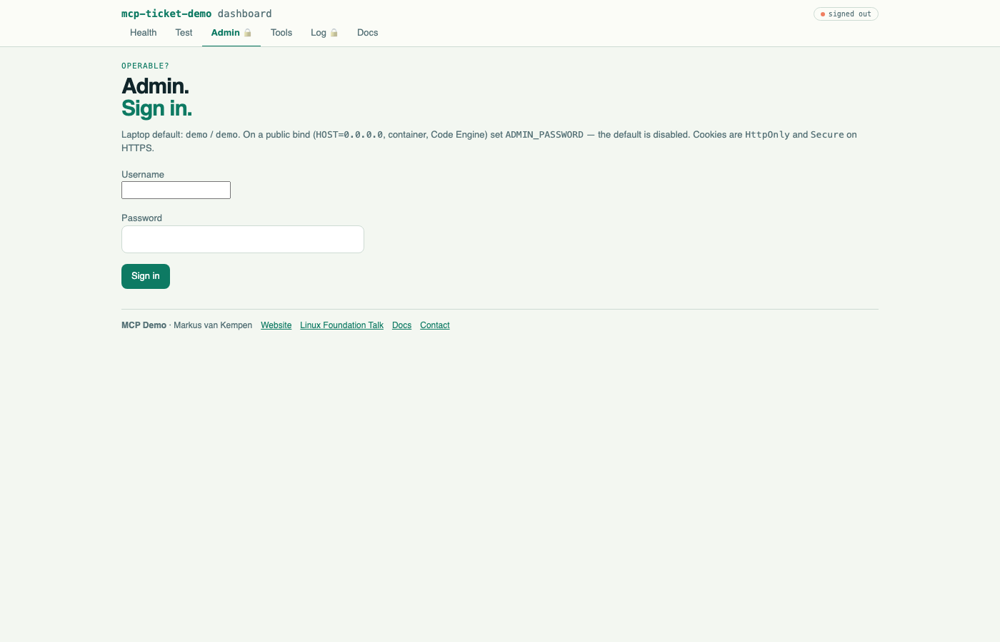
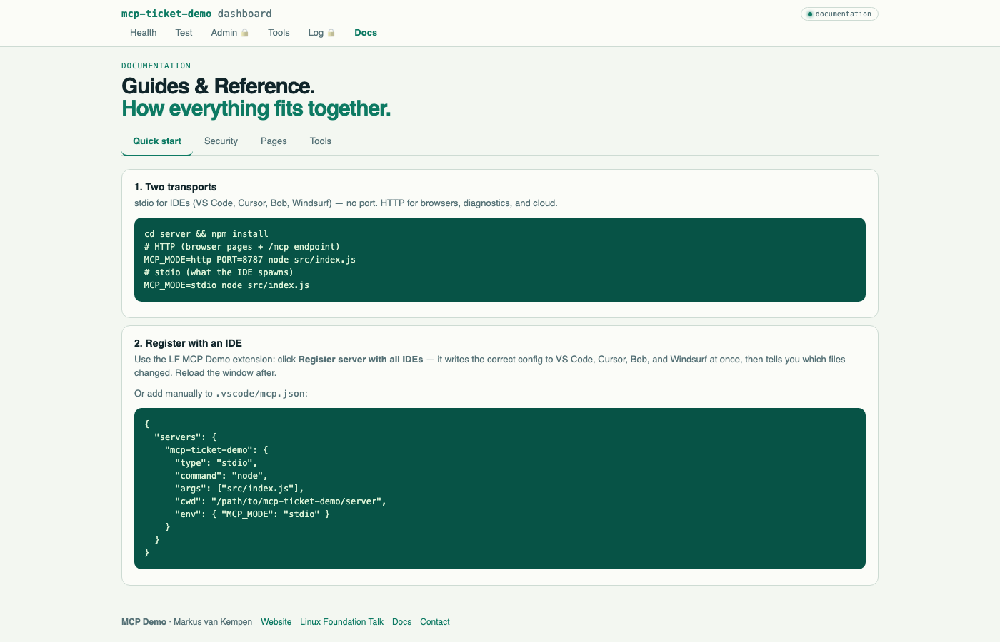
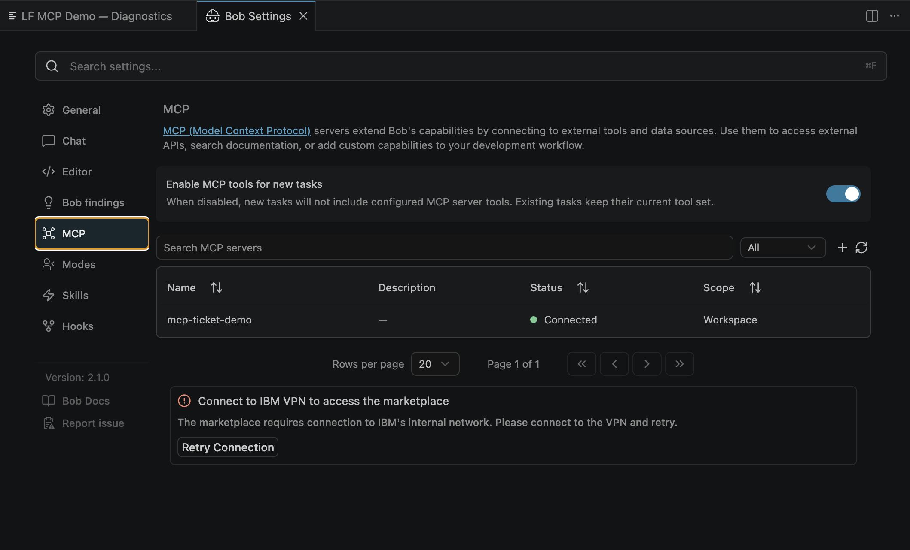

# mcp-ticket-demo

[](https://www.npmjs.com/package/mcp-ticket-demo)
[](https://www.npmjs.com/package/mcp-ticket-demo)
[](https://nodejs.org/)
[](https://modelcontextprotocol.io/)
[](https://www.ibm.com/products/code-engine)
[](https://github.com/markusvankempen/mcp-ticket-demo/blob/main/LICENSE)
[](https://github.com/markusvankempen/mcp-ticket-demo)
[](https://events.linuxfoundation.org/mcp-dev-summit-toronto/program/schedule/?id=1282401)

A **fully-featured MCP server** that exposes a realistic support-ticketing system over the
Model Context Protocol. This README describes server **3.0.1**.

- **19 tools.** Six run the ticket desk. Eight operate the server itself (`update_settings` changes any setting with one patch). Three are timers (`start_timer`, `stop_timer`, `push_timer`), one is an event (`push_log`), and `watch_system` publishes the machine. Reads that are just a list go through `run_query` instead of a tool each: tickets, customers, settings, users, API keys, the machine, the events already sent, and the call trace, errors and counters. There is no `search_tickets`, `get_ticket`, `lookup_customer`, `get_settings`, `list_schemas`, `export_settings`, `export_log` or per-setting `set_*` tool (only `set_mqtt` stays).
- **Events.** Off by default. Ticket, timer, log and settings events stream to a client over SSE or Streamable HTTP as MCP log notifications.
- **Three transports.** stdio, Streamable HTTP at `/mcp`, and legacy SSE at `/sse`. Each can be switched off at runtime.
- **Schema discovery.** `get_schema` (no name lists every name; a name gives its shape) → `run_query`, instead of a pile of `query_*` tools.
- **Permissions.** Three auth modes, four scopes, API keys, users, per-tool gates and locks, rate limiting, PII redaction, an optional tenant header.
- **Results that explain themselves.** Every result and every refusal carries a `next` field that names one follow-up tool.
- **A desk in the browser.** `/admin`, `/log`, `/tools`, `/test`, `/health`, `/help`, plus copy-paste client pages at `/clients/`. Project, light and dark themes.

Runs as a local stdio child process, a local HTTP server, a Podman or Docker container, or a
public HTTPS host you deploy it to (Render, IBM Code Engine and similar are just examples). Every pattern in the server is a reproducible lesson from the talk
**["MCP as a Platform"](https://markusvankempen.github.io/linuxfoundation-mcp-dev-summit/#1)**
at [MCP Dev Summit Toronto 2026](https://events.linuxfoundation.org/mcp-dev-summit-toronto/program/schedule/?id=1282401).

```
npm install -g mcp-ticket-demo
npx mcp-ticket-demo
```

---

## Transports

```
MCP_MODE=stdio  node src/index.js     child process, no port, no URL (the default)
MCP_MODE=http   node src/index.js     Express: /mcp  /sse  /messages  + the desk pages
```

| Transport | Where | Notes |
|---|---|---|
| stdio | `MCP_MODE=stdio` | Credentials come from the process env: `MCP_API_KEY`, or `MCP_USERNAME` + `MCP_PASSWORD`. |
| Streamable HTTP | `POST /mcp` | Current remote transport. `initialize` opens a session so `tools/list_changed` reaches the client. A plain one-shot POST (curl) is stateless. |
| SSE | `GET /sse`, `POST /messages` | Legacy. Kept for older clients. |

An administrator can switch any transport off with `update_settings` (`protocols`). **At least one stays on.** A disabled HTTP transport answers `404` with the tool to call to turn it back on. Stdio exits with a message if it is off.

`/health`, `/test`, `/admin` and the other desk pages are a convention of this demo, not part of the MCP spec.

---

## Tools

Six tools are the ticket desk. Eight more operate the server. Three are timers, one sends log lines, and `watch_system` publishes the machine. `describe_server` lists every one, and what **you** may call right now.

Every tool has a short purpose that says **when to call it and when not to**, and an output schema. Read tools carry `readOnlyHint`. `close_ticket` and the tools that delete or replace things carry `destructiveHint`. Ticket ids and schema names auto-complete in prompts and resources.

### Ticket desk

| Tool | Scope | What it does |
|---|---|---|
| `describe_server` | read, open in every mode | Call it first, and after any denial. Identity, auth mode, your scopes, rate-limit budget, which tools are available now, resources, prompts, protocols. |
| `create_ticket` | write | Open a ticket. **Always pass `requester_email`**, or the service account owns it and every reply goes to the bot. |
| `add_comment` | write | Comment on a known `ticket_id`. |
| `close_ticket` | write | Resolve a ticket. Optional `resolution` becomes the last comment. Idempotent. |
| `get_schema` | read | Discovery, in one tool. With no `name` it lists every name with a `kind` (`data`, `query` or `tool`). With a `name` it gives that shape or that tool's arguments. Runs nothing and does not do the task. |
| `run_query` | read | Exact-match query on `tickets`, `customers`, `assets`, `timers`, `system`, `settings`, `events`, `users`, `api_keys`, `trace`, `errors` or `counters` only, with `filter`, `fields`, `limit`. **Tickets:** `filter` takes `id` (one ticket, with every field including body and comments), `status` (`open`, `pending`, `solved`; `all` or omitted lists every status), `requester_email`, `attribution` and `query` (keyword in subject or body, any case). A list returns short fields (`id`, `subject`, `status`, `requester_email`, `attribution`, `created_at`); `fields` can add `body`, `comments` and `resolved_at`. `limit` is up to 50, default 10, newest first, and there is no default status filter. **Customers:** `filter` takes `email` or `region`; `phone` is the text `REDACTED` unless the caller holds `pii`. `users`, `api_keys`, `trace`, `errors` and `counters` need the `admin` scope even while auth is `off`; the last three give at most 50 rows per call (`counters` is one row per tool, so use `limit` 50). `trace` records only while audit is on (`update_settings` with `audit=true`); `errors` always. A filter key that is not in the schema's `filterable` list is refused, and the error names the keys you can use. |

### Operating the server

| Tool | Scope | What it does |
|---|---|---|
| `update_settings` | admin | **Every setting is one patch**, shaped like the settings row and all fields optional: `authMode`, `rateLimit` {`enabled`, `limit`, `windowSeconds`}, `audit`, `uiAuth`, `protocols` {`stdio`, `streamableHttp`, `sse`}, `events` {`enabled`, `types`, `autoTimer`, `autoSystem`}, `toolGates` {tool: bool, `false` switches it off and answers `503`}, `toolAuthOverrides` {tool: bool, `true` requires a credential whatever the auth mode} and `toolScopeOverrides` {tool: `read`, `write`, `pii`, `admin` or `default`}. Several parts can go in one call. It is checked first and is **all or nothing**: a refusal is `{ok:false, error, next}` and nothing changes. A success is `{ok, settings, changed[], next}`. Admin scope even while auth is `off`. MQTT is not part of it. |
| `set_mqtt` | admin | Publish the events to an MQTT broker (publish only): URL, topic prefix, credentials, QoS, retain, test message. See [MQTT](#mqtt). |
| `create_user`, `delete_user` | admin | Manage users. Passwords are stored as hashes and never returned. The built-in admin cannot be replaced or removed. List them with `run_query` and `schema=users`. |
| `issue_api_key`, `revoke_api_key` | admin | Manage API keys. The secret is returned once, at issue. Secrets are never listed. List them with `run_query` and `schema=api_keys` (filter by `id`, `label` or `active`). |
| `import_settings` | admin | Restore a settings document. Export is a read: `run_query` with `schema=settings` returns the row, which `import_settings` takes as it is (`kind` is optional). It omits API keys and passwords. |
| `generate_traffic` | read, **any credential** | Runs scripted calls so the log has something in it. Changes no tickets or settings. |

The call trace, the errors and the counters are reads too, not tools: `run_query` with `schema=trace`, `errors` or `counters`. All three need admin and give at most 50 rows per call.



### Timers

Tools start, stop and push a timer. There is **no `get_timer`**: you read a timer through the schema, with `run_query` and `schema=timers`. That is the point of the demo. Actions are tools; reads come from the schema.

| Tool | Scope | What it does |
|---|---|---|
| `start_timer` | read | `seconds` (1 to 3600) starts a countdown. Leave `seconds` out for a stopwatch that counts up. Optional `label`. Returns the timer, with an id like `TMR-1`. |
| `push_timer` | read | `timer_id`, `every_seconds` (1 to 60), `for_seconds` (1 to 3600), `topic`. Makes the timer report its time as events. See Events below. |
| `stop_timer` | read | `timer_id`. The timer keeps its elapsed time and its state becomes `stopped`. Stopping a timer that is already stopped or finished changes nothing and returns `alreadyOver: true`. |

```bash
mcp-ticket-demo call start_timer seconds=30 label=demo
mcp-ticket-demo call run_query schema=timers 'filter={"id":"TMR-1"}'
mcp-ticket-demo call stop_timer timer_id=TMR-1
```

A plain timer has no clock running. A timer is a start time, an optional length and an optional stop time. `state` (`running`, `finished` or `stopped`), `elapsed_ms` and `remaining_ms` are worked out when you query, so a 30 second countdown shows `finished` once 30 seconds have passed. Only a timer you push (`push_timer`, see Events) gets a real interval, and while events are on a countdown also announces `timer.finished`. The `next` hint tells the model how long is left and not to poll in a loop.

- The server keeps at most 50 timers, **in memory**. A restart, a factory reset on `/admin`, or a host that scales to zero (Code Engine) clears them.
- The timer tools are `read` scope, so they follow the same rules as the other read tools: open while auth is `off` or `write`, a credential needed under `all`. Gates, locks, the rate limit and the call trace apply to them like any tool.
- **Declared once.** The timer tools are defined in `src/timer-tools.js`: name, scope, purpose, input and output schemas, annotations, an example call and the function that does the work. The catalog row, the MCP registration, what `get_schema name=start_timer` shows, and the example on the Tools page are all generated from that one definition.

### Events

The server can announce what happens on it and push those events to a client that is listening. **Events are off by default.** Timer events switch themselves on when you call `push_timer` (no admin credential needed). Everything else is turned on with `update_settings` and `events.enabled=true` (admin), the `ANNOUNCE_EVENTS` environment variable at startup, or in the **Events** tab on `/admin` (it uses the connection set on Remote config) and in the Events panel on on `/clients/browser.html`.

| Tool | Scope | What it does |
|---|---|---|
| `push_timer` | read | `timer_id`, optional `every_seconds` (1 to 60, default 5; 0 stops the push), optional `for_seconds` (1 to 3600: report for that long, then end; a stopwatch is stopped then) and `topic`. A running timer reports its time as a `timer.tick` event, the first at once. Up to 10 timers push at a time. If timer events are off it switches them on (see Auto-timer below). |
| `push_log` | write | `line` (up to 200 characters) and optional `topic`. Sends one `log.line` event to the listeners and says how many received it. |
| `update_settings` `events` | admin | `enabled`, `types` (for example `["ticket.*","timer.*","log.line"]`), `autoTimer` and `autoSystem` (both default true). Chooses what the server announces. |

### System

`run_query` with `schema=system` reads the machine the server is running on, as one row: hostname, CPU count and load, memory, and disk space on `/`. **Inside Docker, Podman or Kubernetes the memory and CPU figures are the container's cgroup limit** (`memory.max`, `cpu.max`), not the host's, because a container otherwise reports the host. On a Mac, memory used leaves out cached pages (free + inactive + speculative from `vm_stat`), because `os.freemem()` counts that cache as used and the gauge would sit near full on a quiet laptop. Disk is the filesystem the process can see. The snapshot carries no environment variables and no network addresses.

The same snapshot is a `system.info` event. `watch_system` publishes it every few seconds (the first at once) and, like `push_timer`, switches that kind on itself when `autoSystem` is true, so a dashboard needs no admin credential. `every_seconds` 0 stops it. `run_query` with `schema=events` reads the buffer the server already announced, newest first, which is how a page shows events and log lines by calling a tool instead of holding a stream open. `filter.type` takes the same patterns a listener uses (`ticket.*`), and a caller only sees kinds they may receive.

The page at `/clients/dashboard.html` draws the gauges, the tickets, the timers and the log. **Tools** (the default) polls `run_query` (schemas `tickets`, `system`, `timers` and `events`). **Events** listens on the stream and moves the gauges when `system.info` arrives; **Publish system info** calls `watch_system`.

| Tool | Scope | What it does |
|---|---|---|
| `watch_system` | read | `every_seconds` (1 to 60, default 5; 0 stops), optional `for_seconds` (1 to 3600) and `topic` (default `system`). One watch at a time. |
| `run_query` `schema=system` | read | One snapshot. `cpu.used_percent` is null the first time and the change since the previous call after that. It does not announce anything. No filter keys; use `fields` to pick parts. |
| `run_query` `schema=events` | read | Newest events from the buffer, `limit` 1 to 50. `filter` by `type` (a name or a group) and `topic`. |

#### Getting events to flow

Three things have to be true: the server announces the kind, a client is listening, and the thing happens. Most "I hear nothing" cases are the first one.

| You want | What you need | How |
|---|---|---|
| **Timer ticks** (the easiest) | A read-scope call | Call `start_timer`, then `push_timer`. If timer events are off, `push_timer` switches them on itself, so **no admin credential is needed**. The answer says `switchedOn: true`. |
| **Machine snapshots** | A read-scope call | Call `watch_system`. If `system.info` is off, `watch_system` switches it on itself (`autoSystem`, default true). Or open `/clients/dashboard.html`. |
| Log lines, ticket events, settings events | An admin credential, once | `update_settings` with `events.enabled=true` and the kinds you want. Or start the server with `ANNOUNCE_EVENTS`, which needs no credential at all. |
| To listen | Nothing, or a key for more kinds | Connect to `/sse` or `/mcp` (see below). An anonymous listener sees the open kinds. |

**Switch events on at startup, with no credential.** Set `ANNOUNCE_EVENTS` in the server's environment. `on` (or `*`) announces every kind; a list announces just those:

```bash
ANNOUNCE_EVENTS=on npx mcp-ticket-demo --http
ANNOUNCE_EVENTS="timer.*,log.line,ticket.*" MCP_MODE=http PORT=8787 node src/index.js
```

**Get an admin credential** (for `update_settings`, which is admin scope even while auth mode is `off`). Pick one:

1. **Username and password.** On a laptop the default is `demo` / `demo` (set `ADMIN_USER` and `ADMIN_PASSWORD` for anything else; on a public bind the default is disabled). Enter them in the Connection fields on `/admin` → Remote config or on `/clients/browser.html`, or send HTTP Basic: `curl -u "$ADMIN_LOGIN" …`, where `ADMIN_LOGIN` holds the user name and password joined by a colon (on a laptop both are `demo`).
2. **An API key with the admin scope.** On `/admin` → API Keys, tick `admin`, create the key and copy it once. Paste it as the bearer key, or send `Authorization: Bearer <key>`.
3. **Over stdio.** Put the key in `MCP_API_KEY` (or `MCP_USERNAME` and `MCP_PASSWORD`) in the server's env block.

A refusal reads `update_settings requires a credential with the admin scope, even when auth mode is "off"`. It is not a bug and retrying unchanged will not help: add one of the credentials above, or use `push_timer`, or start with `ANNOUNCE_EVENTS`.

**Auto-timer.** `push_timer` switches on `timer.started`, `timer.tick`, `timer.finished` and `timer.stopped` when they are off, and turns announcing on as a whole. It adds only those four kinds and leaves your other choices alone. The switch-on is written to the audit trail and sent as a `settings.changed` event with `by: "push_timer"` (admin listeners see it). An administrator who does not want a read key to do that sets `events.autoTimer=false` with `update_settings`; then `push_timer` answers that nobody will hear the ticks and how to allow it. `run_query` with `schema=settings` shows `events.autoTimer`.

**If you hear nothing**

| Symptom | Cause | Fix |
|---|---|---|
| The status says "The server is not announcing events" | Events are off | Press **Turn events on** in the Events panel (admin), call `push_timer`, call `update_settings` with `events.enabled=true`, or start with `ANNOUNCE_EVENTS=on` |
| `update_settings` is refused: "requires a credential with the admin scope" | No admin credential | See "Get an admin credential" above, or use `push_timer` for timer events |
| `push_log` answers `delivered: false` | `log.line` is not announced | Needs `update_settings` with `events` (admin) or `ANNOUNCE_EVENTS`; `push_timer` does not switch on log lines |
| `Listening over Streamable HTTP` but the list stays empty | Nothing happened yet, or the kind is filtered | Press **Run the demo**; check the Events filter says `*` and the Topic is empty |
| Admin kinds (settings, users, keys) never arrive | The listener is not admin | Connect with an admin credential; the hello message lists what you receive |
| Ticks stop after a while | The timer ended (30 s countdown) or the server restarted | Start another timer; timers and streams are in memory |
| Nothing arrives from `curl -X POST` | A one-shot POST has no stream | Hold a session open with `/sse` or `GET /mcp` |

**The kinds.** `log.line` · `ticket.created`, `ticket.commented`, `ticket.closed`, `ticket.updated`, `ticket.deleted` · `timer.started`, `timer.tick`, `timer.finished`, `timer.stopped` · `settings.changed`, `user.created`, `user.deleted`, `key.issued`, `key.revoked`, `server.reset`. `get_schema` with `name=events` lists them. The admin kinds (`ticket.updated`, `ticket.deleted` and the settings, users, keys and reset kinds) go only to a listener that holds the admin scope. An event never carries ticket text, an email address, a password or a key secret.

**Listening.** An event is a standard MCP logging notification: `notifications/message`, with the kind as `logger` and the event as `data`. A client has to hold a session open, so a one-shot `curl` POST cannot listen.

| Transport | How |
|---|---|
| Legacy SSE | `GET /sse?events=timer.*,log.line&topic=demo`, then POST `initialize` and `notifications/initialized` to the `/messages?sessionId=…` URL the stream names |
| Streamable HTTP | POST `initialize` to `/mcp`, POST `notifications/initialized` with the `Mcp-Session-Id` header, then `GET /mcp?events=…&topic=…` with that header |
| stdio | set `MCP_EVENTS=ticket.*,timer.*` (and `MCP_EVENTS_TOPIC`) in the environment of the process |

`events` takes names and patterns (`*`, `ticket.*`). `topic` keeps only events sent to that topic. The first message on every stream is `events.subscribed`: whether the server is announcing, what this connection receives, and what it asked for but may not have. A listener with no or a wrong key is treated as anonymous, not refused.

```text
event: message
data: {"method":"notifications/message","params":{"level":"info","logger":"timer.tick","data":{"id":3,"type":"timer.tick","at":"2026-10-02T14:50:00.453Z","data":{"timer_id":"TMR-1","label":"demo","state":"running","elapsed_ms":104,"remaining_ms":5896,"every_seconds":2},"topic":"demo"}},"jsonrpc":"2.0"}
```

- **Run the demo.** One button on the Events tab (`/admin#adm-events`) and in the browser client: it turns events on (`log.line`, `ticket.*`, `timer.*`), starts listening, starts the timer chosen in its settings (a 30 s countdown every 5 s unless you change it) and has it report its time, so ticks appear in the list at once. With an admin credential on the connection it switches on the full set; **without one it still works for timers** (`push_timer` switches those on itself) and tells you the log line and ticket events need an admin credential.
- **Timer settings (Countdown or Clock).** Above **Run the demo** the panel has three settings that both **Run the demo** and **Push a timer** use, and the button label shows them (for example `Push a timer (120 s, every 5 s)`). *Timer*: **Countdown** counts down to zero and ends with `timer.finished`; **Clock** is a heartbeat that sends the time as it counts up and is stopped by the server after the time you chose, ending with `timer.stopped`. *Runs for*: 1 to 3600 seconds. *Every*: 1 to 60 seconds. The panel refuses an *Every* longer than *Runs for*. By hand: a countdown is `start_timer {"seconds":120}` then `push_timer {"timer_id":"TMR-1","every_seconds":5}`; a clock is `start_timer {}` (no seconds, a stopwatch) then `push_timer {"timer_id":"TMR-1","every_seconds":5,"for_seconds":120}`.
- **Test it.** The Events panel has **Test the subscription**: it opens a stream with a topic of its own, sends a line with `push_log`, and checks that the line arrives, over either transport.
- Timers that finish or push use real timers on the server. They are **in memory**, and a host that scales to zero drops them and every open stream.
- Events and the settings of which kinds are on are part of the settings row (and so of an export), and so are the MQTT settings (never the broker password).
- The VS Code extension has its own **Events** tab. A webview cannot hold a stream open, so the extension host opens it (with this same client, `clients/events-client.js`) and hands every event to the tab. It listens over both transports, applies the logging level, and has the MQTT section too.
- Declared once, like the timers: `src/event-tools.js` and `src/events.js`.

#### Logging level (`logging/setLevel`)

Every event goes out at an MCP logging level, and a client chooses the lowest level it wants with `logging/setLevel`. The level is **per connection**: one client can ask for `warning` while another keeps everything. Events below a client's level are not sent to it. A client that never calls it receives everything.

| Level | Events |
|---|---|
| `info` | `ticket.created`, `ticket.commented`, `ticket.closed`, `ticket.updated`, every `timer.*`, and the `events.subscribed` greeting |
| `notice` | `ticket.deleted`, `settings.changed`, `user.created`, `user.deleted`, `key.issued`, `key.revoked` |
| `warning` | `server.reset` |
| any level | `log.line` carries the `level` its sender gave to `push_log` (`debug`, `info`, `notice`, `warning`, `error`, `critical`, `alert`, `emergency`; default `info`) |

```bash
# on a Streamable HTTP session (SESSION is the Mcp-Session-Id of the stream you opened)
curl -s -X POST localhost:8787/mcp -H "Mcp-Session-Id: $SESSION" -H 'Content-Type: application/json' \
  -H 'Accept: application/json, text/event-stream' \
  -d '{"jsonrpc":"2.0","id":9,"method":"logging/setLevel","params":{"level":"warning"}}'
```

The Events panel (admin, browser client, extension) has a **Minimum level** choice next to Listen, and a **Level** next to *Send a line now*. Every event also carries its level in the MQTT payload. The level is not applied to the `events.subscribed` greeting that opens a stream, which is sent at `info`.

#### MQTT

The server can also publish every event to an **MQTT broker**, so anything that speaks MQTT (Node-RED, Home Assistant, a dashboard, `mosquitto_sub`) can follow the desk. It is **publish only** and it brings no new npm package: a small MQTT 3.1.1 client is built in (`src/mqtt.js`), over TCP (`mqtt://host:1883`) or TLS (`mqtts://host:8883`), with QoS 0 or 1. It is not a broker and it does not subscribe: bring your own (mosquitto, EMQX, HiveMQ, a cloud broker). MQTT over WebSocket (`ws://`) is not supported.

```bash
# 1. a broker on this machine (mosquitto), and a listener on every topic of the server
mosquitto_sub -h localhost -t 'mcp-ticket-demo/events/#' -v

# 2. the server, with events and the bridge on from startup
ANNOUNCE_EVENTS=on MQTT_URL=mqtt://localhost:1883 MCP_MODE=http PORT=8787 node src/index.js

# 3. cause something
curl -s -X POST localhost:8787/mcp -H 'Content-Type: application/json' -H 'Accept: application/json, text/event-stream' \
  -d '{"jsonrpc":"2.0","id":1,"method":"tools/call","params":{"name":"push_log","arguments":{"line":"hello broker","level":"warning","topic":"demo"}}}'
```

```text
mcp-ticket-demo/events/log.line/demo {"id":6,"type":"log.line","at":"2026-10-02T16:38:22.726Z","level":"warning","data":{"line":"hello broker","level":"warning"},"topic":"demo"}
```

- **Topics.** `<prefix>/<kind>`, for example `mcp-ticket-demo/events/ticket.created`. An event sent to a topic adds that as a last segment (`…/timer.tick/demo`), made safe for MQTT (`+ # /` and spaces become `_`). The default prefix is `mcp-ticket-demo/events`. Subscribe to `<prefix>/#` for everything, or `<prefix>/timer.tick/#` for one kind.
- **Payload.** The event as JSON: `id`, `type`, `at`, `level`, `data` and `topic` when there is one. Never ticket text, an email, a password or a key.
- **What is published follows Events.** Nothing leaves while events are off, and only the kinds you selected. `push_timer` still switches the timer kinds on by itself, so timer ticks reach the broker too.
- **Admin kinds are never published** (`settings.changed`, `user.*`, `key.*`, `server.reset`, `ticket.updated`, `ticket.deleted`): a broker has no idea who may read what, and anyone who can subscribe to it would see them.
- **Settings.** Admin tab **Events** → **MQTT**, the `set_mqtt` tool, the CLI (`mcp-ticket-demo mqtt --enabled on --broker mqtt://localhost:1883 --test`), or the environment at startup. `url`, `topic_prefix`, `username`, `password`, `qos` (0 or 1), `retain`, `enabled`; `test=true` publishes one message to `<prefix>/test`. Leaving a field out keeps it. Do not put the user name or password in the URL; it is refused.
- **The password** is kept in memory only. It is not in `run_query schema=settings` (which shows `hasPassword`), the export, the audit trail, the call trace or an event, and an import never carries it. Sending an empty password clears it.
- **The connection.** `run_query schema=settings` → `mqtt.status` shows `state` (`off`, `connecting`, `connected`, `error`), the last error, how many messages were published or failed, and the last topic. A broker that is not there yet is retried with a growing wait (1 s up to 30 s); up to 50 messages wait for the connection. A refused login (wrong user or password) is not retried until you change the settings. An enabled bridge never keeps the process alive.
- **Not supported:** subscribing, MQTT 5, WebSocket, client certificates, a will message.

| Variable | Purpose |
|---|---|
| `MQTT_URL` | Broker, `mqtt://host:1883` or `mqtts://host:8883`. Setting it turns the bridge on. |
| `MQTT_USERNAME` / `MQTT_PASSWORD` | Broker login |
| `MQTT_TOPIC_PREFIX` | Default `mcp-ticket-demo/events` |
| `MQTT_QOS` / `MQTT_RETAIN` | `0` or `1` / `true` |

### Schema discovery: data, query, tool

`get_schema` with no `name` returns every name with a `kind`, and with a `name` the shape or the tool's arguments, so a model cannot mistake a shape for a tool. One tool does both jobs because a model that has just listed the names needs the next call to be the same tool:

| `kind` | Names | Use |
|---|---|---|
| `data` | `server`, `ticket`, `customer` | A shape only. Not a tool and not a `run_query` name. The result says which tool reads it. |
| `query` | `tickets`, `customers`, `assets`, `timers`, `system`, `settings`, `events`, `users`, `api_keys`, `trace`, `errors`, `counters` | The **only** names `run_query` accepts (12). `users`, `api_keys`, `trace`, `errors` and `counters` need `admin`. |
| `tool` | Every tool name | The argument shape for that tool. It does not run the tool. Call the tool to do the work. |

```
tickets    id · subject · status · requester_email · attribution · created_at
           filterable: status · requester_email · attribution

customers  email · name · plan · region
           filterable: email · region

assets     id · name · site · status
           filterable: status · site

timers     id · label · seconds · state · started_at · ends_at · stopped_at · elapsed_ms · remaining_ms
           filterable: id · state · label
```

### Resources and prompts

```
resources   ticket://TCK-1001     one ticket
            tickets://open        the open list
            schema://tickets      a query shape (tickets | customers | assets | timers — never a tool name)

prompts     search-open-tickets · attribution-scar · schema-discovery
            close-ticket-flow · diagnose-server
```

Resource reads follow the same auth as `run_query` and `get_schema`. A denied read is a JSON-RPC error, not a pin-able fake ticket.

The server also sends **instructions** on connect. The model reads them before its first call: start with `describe_server`, pass `requester_email`, stop on an empty result, do the task by calling the tool, and follow the `next` field once.

### Results and errors

A successful call returns its JSON in the text content **and** in `structuredContent`. A refusal or error sets `isError: true` and carries the JSON in the text content only:

```json
{
  "ok": false,
  "error": "create_ticket requires authentication because auth mode is \"write\". Send Authorization: Bearer <api key> (create one on /admin → API keys) or HTTP Basic with a username and password. Over stdio set MCP_API_KEY in the server env. Call describe_server to see the scopes you hold. Do not retry this call unchanged.",
  "status": 401,
  "denied": true,
  "principal": "anonymous",
  "next": "Call describe_server to see the auth mode and the scopes you hold. Present a credential with the scope named in the error, then retry this tool once."
}
```

A key that lacks a scope gets a `403` that lists the scopes it holds and names the one it needs. Either way the refusal says where to get a key, so the model asks for one instead of retrying.

---

## Quick start

### From npm (what an IDE spawns)

```bash
npx mcp-ticket-demo
# or
MCP_MODE=stdio npx mcp-ticket-demo
```

Add it to your IDE's `mcp.json`:

```json
{
  "mcpServers": {
    "mcp-ticket-demo": {
      "command": "npx",
      "args": ["mcp-ticket-demo"]
    }
  }
}
```

### HTTP desk from npm

```bash
MCP_MODE=http PORT=8787 npx mcp-ticket-demo
# mcp-ticket-demo http on 127.0.0.1:8787
```

`PORT` defaults to **8080** when you leave it out.

### From a clone

```bash
git clone https://github.com/markusvankempen/mcp-ticket-demo
cd mcp-ticket-demo/server
npm install
npm run http       # http://127.0.0.1:8787
```

`npm run http` stops whatever is already listening on the port and starts the desk, so you can rerun it after an edit. Pick another port with `PORT=8799 npm run http`.

| Script | What it does |
|---|---|
| `npm run http` | Desk on `127.0.0.1:8787` (frees the port first) |
| `npm run stdio` | stdio transport. It waits on stdin, so use it from an editor |
| `npm start` | `node src/index.js`, mode from `MCP_MODE` |
| `npm test` | Small smoke test |
| `npm run test:tools` | The full tool suite. 271 checks, starts its own server |
| `npm run test:ops` | The operating tools (`update_settings`, users, keys, `import_settings`, the trace, errors and counters queries, auth modes, gates and scopes) and the Remote config page, including its Demo setup and the hooks the VS Code extension uses, and the curl commands on `/help`. 433 checks, starts its own server |
| `npm run test:cli` | The command line client, run for real against its own server, including a check that it and the Remote config page agree on the Demo setup, and that `/clients/cli.html` stays accurate. 252 checks |
| `npm run test:events` | Event streaming, including logging/setLevel on both transports: the kinds, who may receive what, `push_timer` and auto-timer, `push_log`, `update_settings` events, `watch_system`, `run_query` on `system` and `events`, `ANNOUNCE_EVENTS` at startup, real SSE and Streamable HTTP streams, the subscription test and the Events panel. 349 checks |
| `npm run test:mqtt` | The MQTT bridge against a small broker written in the test: the packets, settings checks, topics and payloads, QoS 1, a broker that is late or says no, `set_mqtt`, export and import. 77 checks |
| `npm run test:system` | The machine snapshot: host figures, a Docker cgroup limit, CPU percent, and the system watch. 17 checks |
| `npm run test:all` | Smoke, system, tools, ops, cli, events and mqtt in a row |
| `npm run test:smoke` | Smoke test against `PORT=8799` |

### Open these in a browser

| Page | What it does |
|---|---|
| `/health` | Liveness and posture. Version, tool count, auth mode. `cwd` only on localhost. JSON at `/health?format=json`. |
| `/test` | Read-only smoke. `/test?write=1` creates and closes a ticket, after admin sign-in. JSON at `/test?format=json`. |
| `/admin` | Sign in (`demo` / `demo` on a laptop). Security, API Keys, Tool Gates, Remote config, Lab, Data, Users. |
| `/log` | Tool counters, admin audit trail, call trace, error log. Admin only. |
| `/tools` | Tool inventory with current scope enforcement and a **▶ Try** button for each tool. |
| `/help` | Guides and architecture reference. The Tools tab groups the 19 tools (Ticket desk, Timers, Events, System, Operate the server) with a copy-ready curl command for every tool (open it at `/help#help-tools`). |
| `/clients/` | Copy-paste setup pages for Cursor, VS Code, Claude Desktop, Windsurf, a browser client, the command line, and a settings page. |





---

## Command line

The same `mcp-ticket-demo` command is also a client for a running server, local or deployed. With **no arguments** it is still the MCP server, so every `mcp.json` above keeps working. With a **command** it talks to a server over MCP, the way an agent would, and prints the answer.

```bash
npx mcp-ticket-demo status                                   # http://127.0.0.1:8787/mcp by default
npx mcp-ticket-demo status --url https://my-host.example.com # or MCP_URL; /mcp is added for you
npx mcp-ticket-demo call run_query schema=tickets 'filter={"status":"open"}' limit=5  # any tool, values typed from its schema
npx mcp-ticket-demo users list --user demo --password-stdin  # the operate tools need an admin credential
npx mcp-ticket-demo demo apply --user demo --password demo   # the Demo setup from Remote config
```

From a clone, `node src/index.js status` is the same thing.

| Command | What it does |
|---|---|
| `status` | Version, auth mode, rate limit, call trace, transports, users, keys, locked and disabled tools |
| `tools` | The tools the server offers |
| `call <tool> [key=value ...]` | Run any tool. `--args '{...}'` or `--args-file f.json` for nested input. The words win over `--args` |
| `settings [show \| export [--out f] \| import f]` | Read, save or restore the whole settings document |
| `auth-mode [off\|write\|all]` | Who must sign in |
| `rate-limit [--limit n] [--window s] [--on \| --off]` | The per-caller limit |
| `trace [show \| on \| off]` | The call trace. `show --limit 50` lists recent calls |
| `gate <tool> <on\|off>` · `lock <tool> <on\|off>` | Switch a tool off for everyone, or require a credential for it |
| `scope <tool> <read\|write\|pii\|admin\|default>` | Change the scope one tool requires |
| `mqtt [--enabled on\|off] [--broker URL] [--prefix P] [--broker-user U] [--broker-password PW] [--qos 0\|1] [--retain on\|off] [--test]` | Show or set the MQTT bridge. `--user`/`--password` are your login to this server; the `--broker-*` ones are the broker's |
| `protocols [--stdio on\|off] [--http ...] [--sse ...]` | The transports |
| `ui-auth [on\|off]` | Hide the desk pages until an admin signs in |
| `users [list \| create <name> \| delete <name>]` | Users that sign in with HTTP Basic |
| `keys [list \| create \| revoke <id>]` | API keys. A secret is shown once, when it is created |
| `demo <apply \| check \| remove>` | Four users, four keys, trace on, sample traffic, auth `write`, 30 calls per 60 s. `check` acts as each role and as nobody. `--skip users,keys,auth,rate,audit,traffic`, `--keys-file f` |

`mcp-ticket-demo --help` lists every option; `mcp-ticket-demo help <command>` explains one.

**Connecting.** `--url` (or `MCP_URL`) takes the MCP endpoint or the server's base address, and a pasted `/admin` or `/health` address works too. A credential is `--key` (or `MCP_API_KEY`), or `--user` with a password. A key wins when both are given. The password comes from `MCP_PASSWORD`, from `--password-stdin` (first line), from a hidden prompt at a terminal, or from `--password`, which also works but is visible in your shell history, so the command says so. A local server has the admin `demo` / `demo`. The operate tools (rate limit, users, keys, settings, log) need the `admin` scope even while auth is off. Every call goes through `/mcp`, so the rate limit, scopes and call trace apply to the CLI like any other client.

**Changing things.** Commands that delete, revoke, import, turn a transport off, or apply or remove the demo setup ask first. With no terminal they refuse rather than guess; pass `--yes` (`-y`) to go ahead, for scripts.

**Scripting.** `--json` prints one JSON document on stdout and nothing else, errors included: `{"ok": false, "error": "...", "status": 403, "exitCode": 1}`. Exit codes: `0` done, `1` the server refused or a check failed, `2` usage error, `3` the server could not be reached. Secrets are printed only where you asked for them (`keys create`, `demo apply`) and never in `keys list`, `users list`, errors or `--json` output of the check commands. Examples:

```bash
KEY=$(npx mcp-ticket-demo keys create --label ci --scopes read --json --key "$ADMIN_KEY" | jq -r .key)
npx mcp-ticket-demo demo apply -y --keys-file demo-keys.json --user demo --password-stdin <<< demo
npx mcp-ticket-demo demo check --keys-file demo-keys.json --user demo --password-stdin <<< demo || echo "demo is not set up"
```

---

## Endpoints

| Endpoint | Purpose |
|---|---|
| `POST /mcp` | Streamable HTTP MCP transport (JSON-RPC 2.0) |
| `GET /sse`, `POST /messages` | Legacy SSE MCP transport |
| `GET /health` | Liveness. Version, tool count. `cwd` only on localhost |
| `GET /test` | Read-only smoke. `?write=1` needs admin |
| `GET /tools` | Tool inventory page (`?format=json` for JSON) |
| `GET /help` | Guides |
| `GET /admin` | Admin desk (needs sign-in) |
| `GET /admin/api/status` | Security snapshot, recent tickets and audit as JSON (needs sign-in) |
| `GET /admin/settings/export`, `POST /admin/settings/import` | Settings document in and out (needs sign-in) |
| `GET /admin/log/export` | Counters, errors and trace as JSON (needs sign-in) |
| `GET /log` | Call trace page (needs sign-in) |
| `GET /clients/…` | Client setup pages, `theme.css`, `theme.js`, `icon.svg`, `favicon.ico` |

Sign-in sets a session cookie named `mcp_admin`.

---

## curl reference

All examples assume the server is on `http://127.0.0.1:8787`. Replace the host with the URL of your deployed server (for example `https://<your-app>.onrender.com`) for remote testing.

**`/mcp` needs both `Accept` values.** `Accept: application/json` alone is refused with `Not Acceptable: Client must accept both application/json and text/event-stream`.

### Health and smoke test

```bash
curl -s "http://127.0.0.1:8787/health?format=json" | jq .

# Public read-only smoke: describe, schemas, query. No writes.
curl -s "http://127.0.0.1:8787/test?format=json" | jq .

# Exit-code style check: 200 = all steps passed, 500 = a step failed
curl -s -o /dev/null -w "%{http_code}" "http://127.0.0.1:8787/test?format=json"
```

### MCP tool calls over HTTP (JSON-RPC 2.0)

```bash
BASE=http://127.0.0.1:8787
MCP=(-H "Content-Type: application/json" -H "Accept: application/json, text/event-stream")

# Discover the server. Always call this first.
curl -s -X POST $BASE/mcp "${MCP[@]}" \
  -d '{"jsonrpc":"2.0","id":1,"method":"tools/call","params":{"name":"describe_server","arguments":{}}}' | jq .

# List all tools (19)
curl -s -X POST $BASE/mcp "${MCP[@]}" \
  -d '{"jsonrpc":"2.0","id":2,"method":"tools/list","params":{}}' | jq .

# Find open tickets (run_query, schema tickets)
curl -s -X POST $BASE/mcp "${MCP[@]}" \
  -d '{"jsonrpc":"2.0","id":3,"method":"tools/call","params":{"name":"run_query","arguments":{"schema":"tickets","filter":{"status":"open"},"limit":5}}}' | jq .

# Create a ticket WITH requester_email (correct)
curl -s -X POST $BASE/mcp "${MCP[@]}" \
  -d '{"jsonrpc":"2.0","id":4,"method":"tools/call","params":{"name":"create_ticket","arguments":{"subject":"Test from curl","body":"Sent via terminal.","requester_email":"ada@example.com"}}}' | jq .

# Create a ticket WITHOUT requester_email: the attribution scar (201, but the bot owns it)
curl -s -X POST $BASE/mcp "${MCP[@]}" \
  -d '{"jsonrpc":"2.0","id":5,"method":"tools/call","params":{"name":"create_ticket","arguments":{"subject":"Scar demo","body":"No email. The service account will own this."}}}' | jq .

# Get one ticket (all fields, with body and comments)
curl -s -X POST $BASE/mcp "${MCP[@]}" \
  -d '{"jsonrpc":"2.0","id":6,"method":"tools/call","params":{"name":"run_query","arguments":{"schema":"tickets","filter":{"id":"TCK-1001"}}}}' | jq .

# Add a comment
curl -s -X POST $BASE/mcp "${MCP[@]}" \
  -d '{"jsonrpc":"2.0","id":7,"method":"tools/call","params":{"name":"add_comment","arguments":{"ticket_id":"TCK-1001","body":"Confirmed from the terminal.","author":"ada@example.com"}}}' | jq .

# Schema discovery, then a query (get_schema with no name lists every name)
curl -s -X POST $BASE/mcp "${MCP[@]}" \
  -d '{"jsonrpc":"2.0","id":8,"method":"tools/call","params":{"name":"get_schema","arguments":{}}}' | jq .

curl -s -X POST $BASE/mcp "${MCP[@]}" \
  -d '{"jsonrpc":"2.0","id":9,"method":"tools/call","params":{"name":"get_schema","arguments":{"name":"tickets"}}}' | jq .

curl -s -X POST $BASE/mcp "${MCP[@]}" \
  -d '{"jsonrpc":"2.0","id":10,"method":"tools/call","params":{"name":"run_query","arguments":{"schema":"tickets","filter":{"status":"open"},"limit":5}}}' | jq .

# Read a customer: the phone number is REDACTED without the pii scope
curl -s -X POST $BASE/mcp "${MCP[@]}" \
  -d '{"jsonrpc":"2.0","id":11,"method":"tools/call","params":{"name":"run_query","arguments":{"schema":"customers","filter":{"email":"ada@example.com"}}}}' | jq .

# Resources and prompts
curl -s -X POST $BASE/mcp "${MCP[@]}" \
  -d '{"jsonrpc":"2.0","id":12,"method":"resources/list","params":{}}' | jq .

curl -s -X POST $BASE/mcp "${MCP[@]}" \
  -d '{"jsonrpc":"2.0","id":13,"method":"resources/read","params":{"uri":"ticket://TCK-1001"}}' | jq .

curl -s -X POST $BASE/mcp "${MCP[@]}" \
  -d '{"jsonrpc":"2.0","id":14,"method":"prompts/list","params":{}}' | jq .
```

The tool result is JSON-RPC whose `content[0].text` is itself a JSON string. To read a success as plain JSON, pull out `structuredContent`. A refusal has no `structuredContent`, so parse the text:

```bash
# success
curl -s -X POST $BASE/mcp "${MCP[@]}" \
  -d '{"jsonrpc":"2.0","id":15,"method":"tools/call","params":{"name":"describe_server","arguments":{}}}' \
  | jq '.result.structuredContent'

# refusal or error: isError is true, the JSON is in the text
curl -s -X POST $BASE/mcp "${MCP[@]}" \
  -d '{"jsonrpc":"2.0","id":16,"method":"tools/call","params":{"name":"run_query","arguments":{"schema":"tickets","filter":{"id":"TCK-9999"}}}}' \
  | jq '.result | {isError, body: (.content[0].text | fromjson)}'
```

### Authenticated calls (auth mode `write` or `all`)

```bash
KEY=mcpk_your_api_key_here

# Authorization header
curl -s -X POST $BASE/mcp "${MCP[@]}" -H "Authorization: Bearer $KEY" \
  -d '{"jsonrpc":"2.0","id":16,"method":"tools/call","params":{"name":"create_ticket","arguments":{"subject":"Authenticated ticket","body":"Sent with an API key.","requester_email":"ada@example.com"}}}' | jq .

# x-api-key header (alternative)
curl -s -X POST $BASE/mcp "${MCP[@]}" -H "x-api-key: $KEY" \
  -d '{"jsonrpc":"2.0","id":17,"method":"tools/call","params":{"name":"run_query","arguments":{"schema":"tickets","filter":{"status":"all"}}}}' | jq .

# HTTP Basic with a user (USER_LOGIN is a login from MCP_USERS, name and password joined by a colon)
curl -s -X POST $BASE/mcp "${MCP[@]}" -u "$USER_LOGIN" \
  -d '{"jsonrpc":"2.0","id":18,"method":"tools/call","params":{"name":"describe_server","arguments":{}}}' | jq '.result.structuredContent.you'
```

### Admin from the terminal

```bash
# 1. Sign in and keep the session cookie
curl -s -c /tmp/mcp_cookies.txt -X POST $BASE/admin/login -d 'username=demo&password=demo'

# 2. Set the auth mode to write
curl -s -b /tmp/mcp_cookies.txt -X POST $BASE/admin/security -d 'authMode=write'

# 3. Read the security snapshot as JSON
curl -s -b /tmp/mcp_cookies.txt $BASE/admin/api/status | jq .security

# 4. Export settings and the call log
curl -s -b /tmp/mcp_cookies.txt $BASE/admin/settings/export | jq .
curl -s -b /tmp/mcp_cookies.txt $BASE/admin/log/export | jq .

# 5. Fill the store and the log (Lab panel)
curl -s -b /tmp/mcp_cookies.txt -X POST $BASE/admin/generate-data -d 'count=10'
curl -s -b /tmp/mcp_cookies.txt -X POST $BASE/admin/generate-traffic -H "Accept: application/json" -d 'rounds=5' | jq .
```

The same operations are also tools: `update_settings` (with `authMode`), `run_query` with `schema=settings`, `trace`, `errors` or `counters`, and `generate_traffic`. All but the last need an `admin` credential, even when auth mode is `off`. Set `ADMIN_LOGIN` in your shell first to the admin user name and password joined by a colon (on a laptop both are `demo`). For example:

```bash
curl -s -X POST $BASE/mcp "${MCP[@]}" -u "$ADMIN_LOGIN" \
  -d '{"jsonrpc":"2.0","id":19,"method":"tools/call","params":{"name":"update_settings","arguments":{"authMode":"write","rateLimit":{"enabled":true,"limit":60,"windowSeconds":60}}}}' | jq .
```

From the command line: `mcp-ticket-demo call update_settings authMode=write 'rateLimit={"enabled":true,"limit":60,"windowSeconds":60}'`, and `mcp-ticket-demo call run_query schema=trace`.

---

## Auth model

```
mode   effect
─────  ──────────────────────────────────────────────────────────
off    All tools callable with no credential. The laptop default.
write  Read tools are open. Write tools need a credential.
all    Every tool call needs a credential.
```

Set the mode with `AUTH_MODE`, on `/admin → Security`, or with `update_settings` (`authMode`). The older `WRITE_TOOLS_LOCKED=1` is read as `write`.

### Scopes

| Scope | Lets you call |
|---|---|
| `read` | Read tools: schemas, `run_query` (tickets, customers, settings and the other schemas) |
| `write` | Write tools (`create_ticket`, `add_comment`, `close_ticket`). Includes `read`. |
| `pii` | Shows the customer `phone` that `run_query` otherwise returns as `REDACTED`. No tool needs `pii`. Includes `read`. |
| `admin` | Everything, including `update_settings`, `set_mqtt`, the user, key and import tools, and the `users`, `api_keys`, `trace`, `errors` and `counters` queries. |

### Credentials

```
HTTP   Authorization: Bearer <api key>
       Authorization: Basic base64(user:pass)
       x-api-key: <api key>

stdio  MCP_API_KEY=<key>                        in the server process env
       MCP_USERNAME + MCP_PASSWORD              in the server process env
```

Issue API keys on `/admin → API Keys`, with `issue_api_key`, or register one at boot with `API_KEY` and `API_KEY_SCOPES`. Users come from `/admin → Users`, `create_user`, or `MCP_USERS="alice:secret:read,write"`.

**An unknown key is refused, even in `off` mode.** Any Bearer or `x-api-key` value is looked up as an API key. A made-up token gets `401` on every tool except `describe_server`. Send a real key, or send nothing.

### What gets checked, in order

1. The tool is switched off by a gate → `503`
2. A credential was sent and it is not recognised → `401` (`describe_server` is exempt)
3. `TENANT_ID` is set and a write or admin call has no matching `x-tenant-id` → `403`
4. The mode or a tool lock needs a credential and there is none → `401`
5. The credential lacks the scope → `403`, naming the scope
6. The caller is over the rate limit → `429` with the seconds to wait

`describe_server` stays open in every mode. A client that cannot ask "what do you need from me?" can only guess.

### Per-tool gates and locks

- **Gate** (`/admin → Tool Gates`, `update_settings` with `toolGates`) switches one tool **off**. It answers `503`.
- **Lock** (`update_settings` with `toolAuthOverrides`) requires a credential for one tool, whatever the auth mode.
- **Scope** (`/admin → Tool Gates`, `update_settings` with `toolScopeOverrides`, CLI `scope <tool> <scope>`) changes which scope a tool needs: `read`, `write`, `pii` or `admin`; `default` restores the tool's own. `describe_server` shows the result as `required_scope`, with `own_scope` next to it when it differs.
  - **Raising** a scope (say `run_query` to `pii`) makes the tool need a credential with that scope, even while the auth mode is `off`.
  - **Lowering** one to `read` opens it in modes `off` and `write` (say `create_ticket` to `read`). Mode `all` still wants a credential.
  - **Admin tools cannot change.** Neither can `describe_server` (always open) or `generate_traffic` (any credential). That is why a lowered scope can never open the control plane.
  - Overrides are part of the settings row and so of `import_settings` (`toolScopeOverrides`). A document without that field leaves them alone; an empty map clears them. Like the rest of the settings they live in memory.
- `describe_server` can be neither gated nor locked.
- Saving a gate, lock or auth-mode change sends `notifications/tools/list_changed` to connected SSE and Streamable HTTP sessions.

### Rate limit

`RATE_LIMIT` calls per `RATE_LIMIT_WINDOW_MS` for each caller (default 60 per minute, one fixed window). A refused call says how many seconds to wait. `describe_server` shows the remaining budget.

### PII

No tool needs `pii`. `run_query` with `schema=customers` is a `read` call, and the `phone` field comes back as the text `REDACTED` unless the caller presents a credential holding `pii`. It is the same tool and the same endpoint; the scopes decide which fields you see, not whether the call works.

### Naive mode (demo)

`/admin → Security → Naive mode` makes anonymous denials on write tools return a bare `403` with no scope and no `next`. A model then retries in a loop. Turn it off and the same call gives the actionable refusal. It exists to show that contrast, and it is off by default.

### Desk sign-in

`update_settings` with `uiAuth=true` hides the HTML pages until you sign in. Tool calls stay up.

### Public deployments

- `demo` / `demo` is for a laptop. When the server binds publicly (`CONTAINER`, `CODE_ENGINE_PROJECT`, or `HOST=0.0.0.0`) **admin sign-in stays disabled until `ADMIN_PASSWORD` is set**.
- `/health` hides `cwd` off localhost, and `/test` stays read-only.
- Requests with an `Origin` header are accepted from localhost, the same host, or an origin listed in `CORS_ORIGINS`.
- Use `AUTH_MODE=write` (or `all`) on anything with a public URL.
- Tickets, users, keys and settings live **in memory**. A restart clears them. User passwords and API-key secrets are held as hashes.

---

## Settings document

`run_query` with `schema=settings` (or `/admin/settings/export`) returns the settings row. `import_settings` takes that row as it is. The row looks like this (abridged: it also carries `events` and `mqtt`, and a saved export from `/admin/settings/export` adds `kind`):

```json
{
  "kind": "mcp-ticket-demo-settings",
  "version": "3.0.1",
  "authMode": "write",
  "rateLimit": { "enabled": true, "limit": 60, "windowSeconds": 60 },
  "audit": false,
  "uiAuth": false,
  "protocols": { "stdio": true, "streamableHttp": true, "sse": true },
  "toolGates": { "describe_server": true, "create_ticket": true, "…": "one boolean per tool" },
  "toolAuthOverrides": { "describe_server": false, "create_ticket": false, "…": "one boolean per tool" },
  "toolScopeOverrides": {},
  "users": [],
  "activeKeyCount": 0
}
```

`import_settings` restores auth mode, rate limit, audit, UI sign-in, protocols, gates, locks and scope overrides (a field left out is left alone). It does **not** restore users or keys, and the export never contains their secrets. The document's `kind` must match, and `describe_server` is never gated or locked by an import.

---

## Environment variables

| Variable | Default | Purpose |
|---|---|---|
| `MCP_MODE` | `stdio` | `stdio` or `http` |
| `PORT` | `8080` | HTTP port. `npm run http` uses `8787` |
| `HOST` | `127.0.0.1` | `0.0.0.0` inside a container (set automatically) |
| `AUTH_MODE` | `off` | `off` / `write` / `all` |
| `ADMIN_USER` / `ADMIN_PASSWORD` | `demo` / `demo` | `/admin` login. On a public bind, sign-in stays off until `ADMIN_PASSWORD` is set |
| `CORS_ORIGINS` | unset | Extra `Origin` values allowed on `/mcp`. Localhost and the same host are always allowed |
| `API_KEY` / `API_KEY_SCOPES` | unset / `read,write` | Register one key at boot |
| `MCP_USERS` | unset | `"alice:secret:read,write"`, comma-separated, for extra logins |
| `MCP_API_KEY` | unset | stdio: the key this process presents |
| `MCP_USERNAME` / `MCP_PASSWORD` | unset | stdio: the Basic credential this process presents |
| `RATE_LIMIT` / `RATE_LIMIT_WINDOW_MS` | `60` / `60000` | Calls per window per caller |
| `RATE_LIMIT_ENABLED` | `1` | `0` turns rate limiting off |
| `ANNOUNCE_EVENTS` | unset | `on` or a list such as `timer.*,log.line`: announce events from startup |
| `MQTT_URL` (+ `MQTT_USERNAME`, `MQTT_PASSWORD`, `MQTT_TOPIC_PREFIX`, `MQTT_QOS`, `MQTT_RETAIN`) | unset | Publish the events to an MQTT broker. See [MQTT](#mqtt) |
| `TENANT_ID` | unset | Writes and admin calls also need an `x-tenant-id` header with this value. stdio sends it for you |
| `CONTAINER` / `CODE_ENGINE_PROJECT` | unset | Mark a cloud or container run: bind `0.0.0.0` and apply the public-deployment rules |

---

## The desk

### Admin

| Tab | What it does |
|---|---|
| Security | Auth mode, naive mode, rate limit, audit mode, settings export and import |
| API Keys | Issue a key (shown once), revoke, see scopes, call count and last use |
| Tool Gates | Switch a tool off, or require a credential for it |
| Browser | Which origins may call `/mcp` from a web page (localhost, this host, `CORS_ORIGINS`), a `CORS_ORIGINS=` line and `fetch()` snippet to copy, and a **Run browser test** that calls `tools/list` and `run_query` from your browser against this server or any other MCP URL you paste (Render, Code Engine, any host). It shows what a real page would see, so a blocked origin appears as a failed fetch with the likely cause |
| Lab | Generate tickets and scripted traffic without an LLM. Also stop or restart the server process (restart works only when started with `node` or `npx`, not in a container) |
| Data | Tickets (newest 50): create, edit, delete. Factory reset back to the seed tickets. Click a column header on the ticket or audit table to sort, click again to reverse |
| Users | Create and delete users with scopes |





### Lab panel (generate data and traffic)

The Lab fills the store and produces log entries without an LLM:

- **Generate data** seeds up to 40 realistic tickets with mixed statuses, emails and comments. 20% omit `requester_email` on purpose, to produce the service-account scar.
- **Generate traffic** runs N rounds of scripted calls covering every log category: happy reads, successful writes, bad ticket ids (error log), invalid credentials (denied counter), valid queries, and unknown-schema queries (error log). Turn audit mode on first to capture the full call trace on `/log`.

### Log

`/log` shows the tool counters (success, error, denied per tool), the admin audit trail, the error log of the last 50 failed calls, and, with audit mode on, the trace of the last 200 calls (the same data as `run_query` with `schema=trace`, `errors` or `counters`, which give up to 50 rows per call). Secrets in arguments (`password`, `api_key`, `secret`, `document`) are recorded as `[redacted]`.

Every table on `/log` sorts: click a column header, click again to reverse. Times are stored in UTC and shown in the **browser's own timezone** (for example `9:24:23 PM` rather than `01:24:23`; an earlier day adds the date). Hover a time for the full local date, the zone name and the original UTC value. `/admin/log/export` (the download route) keeps the raw UTC ISO timestamps.

### Try a tool

On `/tools`, **▶ Try** opens a dialog with example arguments, calls `/mcp`, and shows the response pretty-printed with the inner JSON unpacked.

### Themes

The header on every desk and client page has a theme switch: **project**, **light** or **dark**. The choice is saved in the browser (`localStorage` key `mcp-desk-theme`) and applied before the page paints, so there is no flash.

### Client pages

`/clients/` has a page each for Cursor, VS Code, Claude Desktop, Windsurf, a browser client, the [command line](#command-line) (`cli.html`), and a settings client that queries `settings` and calls `update_settings` (saving needs an admin key). Each one can call the server and shows the request and the raw response. The browser client has forms to read and set the rate limit and call trace, list and create users and API keys (with scope checkboxes, a one-time key box and a "Use as bearer key" button), search tickets, and call any tool from a form built from that tool's schema. A self-test creates a throwaway user and API key, checks the password and secret are never listed, then deletes and revokes them. The operate tools need an `admin` credential even when auth is off, so the page takes a bearer key or a username and password (HTTP Basic, `demo` / `demo` on a laptop).

The same forms are built into the desk as **Admin → Remote config**. Point its MCP URL at this server or at any deployed one (Render, Code Engine, your own host) and manage that server from the page: rate limit, users, API keys, any tool. The page sends its own credential to `/mcp`, since the admin sign-in cookie is not accepted there, and it never saves the credential. A server on another site answers the page only for localhost, its own host or an origin in its `CORS_ORIGINS`; the tab's **Browser access** section builds that line and runs a test from your browser. The tab was called Browser before; old `#adm-browser` links still open it.

**Demo setup** at the top of the tab turns a fresh server into something you can test every feature on. **Apply demo setup** creates four users (`demo-reader`, `demo-writer`, `demo-pii`, `demo-admin`, password `demo-pass`) and four labelled API keys (read, write, pii, admin), turns the call trace on, records sample traffic, sets auth mode to `write` and the rate limit to 30 calls per 60 s. Each key is shown once, with Copy and Use as bearer key. It is safe to run twice: the old demo users and keys are replaced. **Check demo setup** then tests it by acting as each role, anonymous included: who can read, write, see PII or use admin tools, that a wrong password is refused, that passwords and secrets never appear in lists or the log. It leaves one solved "Demo check" ticket behind. **Remove demo setup** revokes the keys, deletes the users and sets auth mode off, the trace off and the rate limit back to 60 per 60 s. Untick a box to skip that part. Saving a rate limit resets every caller's budget, so Apply sets it last and Remove sets it first; if a caller has used its whole budget, Remove stops at Connect and shows the wait time.

---

## What this teaches

```
Lesson 1 — Put the nouns in a schema, keep the verbs as tools
  Tickets are read with one tool: run_query schema=tickets, and a
  filter says which. The tools left are verbs: create_ticket,
  add_comment, close_ticket. Compare to the first draft:
  query_tickets_by_status / query_tickets_by_requester / query_open_tickets.
  Technically correct. The model picked wrong every other call.

Lesson 2 — The silent tool-count failure
  tools/list returns 0 tools with no error when the server starts
  but the cwd is wrong or MCP_MODE is missing. Nothing fails.
  Nothing warns. The tool list is just empty.

Lesson 3 — The attribution scar
  create_ticket without requester_email returns HTTP 201.
  The API call "succeeded". But the service account owns the
  ticket and every reply goes to the bot, not the customer.
  A tool isn't done when the API call succeeds. It's done
  when the next thing that happens is right.

Lesson 4 — Schema discovery over tool proliferation
  get_schema → run_query replaces a pile of
  query_tickets / query_assets / query_with_filter tools.
  And every name carries a kind — data, query or tool — so a
  shape is never mistaken for a tool, and a tool is never
  passed to run_query.

Lesson 5 — The protocol doesn't say who is allowed to call it
  MCP describes tools. It doesn't describe permission. This server
  invents its own: off / write / all modes, four scopes, keys and
  users, gates and locks, and refusals that name the scope and
  where to get a key, so the model asks instead of looping.

Lesson 6 — Laptop paths don't survive a container boundary
  Native stdio uses an absolute local cwd. Podman and Code
  Engine use the image. The path that worked on your laptop
  is meaningless in the container. And the IDE config files
  (.vscode/ .cursor/ .bob/ and the global Windsurf and Cline
  files) all drift independently once a URL changes.

Lesson 7 — Results are instructions
  Every result and every error has a next field that names one
  follow-up tool. The model follows it instead of guessing, and the
  same sentence tells a human what to do.
```

---

## VS Code / Bob / Cursor / Windsurf / Cline extension

The companion **LF MCP Demo** extension is the control plane for this server. It has a sidebar, step-by-step diagnostics, an end-to-end CRUD test, send-to-chat prompts, and one-click commands that write client config without hand-editing `mcp.json`. It carries a copy of this server, so a native stdio connection needs no npm install.

Install from the marketplace:
[VS Code Marketplace](https://marketplace.visualstudio.com/items?itemName=markusvankempen.lf-mcp-summit-demo) ·
[Open VSX](https://open-vsx.org/extension/markusvankempen/lf-mcp-summit-demo)

Key extension features:

- **Connect native stdio** writes the server into `.vscode/mcp.json`, `.cursor/mcp.json` and `.bob/mcp.json`, and into the global Windsurf and Cline files when those are installed. It shows which files it wrote.
- **Connect remote HTTP** writes a Streamable HTTP entry at `/mcp` for each client, with your API key in an `Authorization` header when one is set.
- **Start native HTTP server** runs the desk on the port in `summitMcp.localHttpUrl`, with your auth mode and key.
- **MCP Test tab** runs a full CRUD test (create → get → add_comment → close → search with `status=all`) against the HTTP server and scores the tool payload, not just HTTP 200.
- **Browser tab** sets `CORS_ORIGINS` for a server the extension starts and tests browser access: a preflight and a real `run_query` call sent with the page's `Origin`, plus a check that an unlisted site is refused. It also opens `/clients/browser.html` and copies a `fetch()` snippet.
- **Diagnose** checks the workspace, config files, `/health`, `/test`, `tools/list` and a live `run_query` call.
- **Auto-approve** lists the six ticket-desk tools for Bob and Cline. The admin tools still ask first.




---

## Requirements

- Node.js >= 18

## Dependencies

- `@modelcontextprotocol/sdk` — MCP server SDK
- `express` — HTTP transport and the desk
- `zod` — schema validation

---

## Author

**Markus van Kempen**

| | |
|---|---|
| 📧 | [markus.van.kempen@gmail.com](mailto:markus.van.kempen@gmail.com) |
| 🌐 | [markusvankempen.github.io](https://markusvankempen.github.io/) |
| 🎤 | [MCP Dev Summit Toronto — Speaking Session](https://events.linuxfoundation.org/mcp-dev-summit-toronto/program/schedule/?id=1282401) |
| 📊 | [Talk slides — MCP as a Platform](https://markusvankempen.github.io/linuxfoundation-mcp-dev-summit/#1) |
| 💻 | [github.com/markusvankempen/mcp-ticket-demo](https://github.com/markusvankempen/mcp-ticket-demo) |

> *No bug too small, no syntax too weird.*

*Personal open-source demo.*
